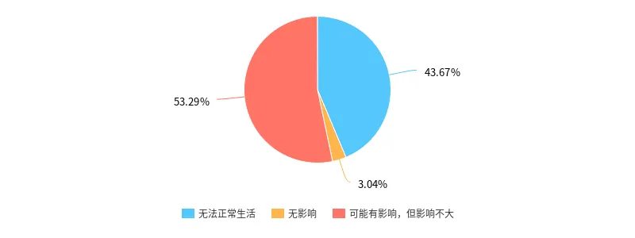
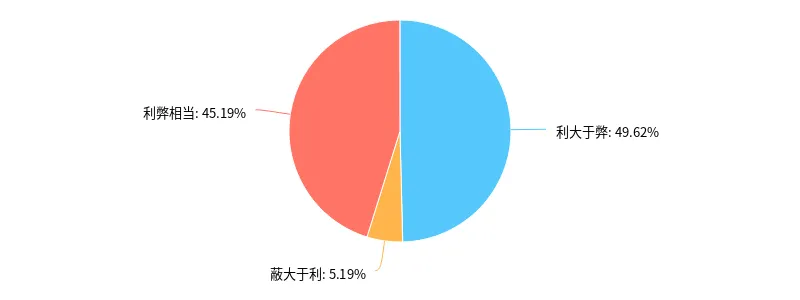
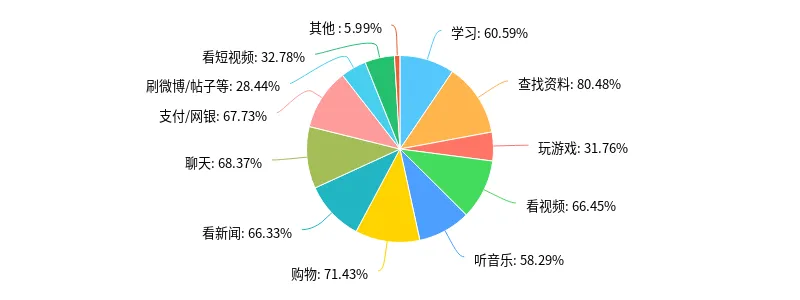
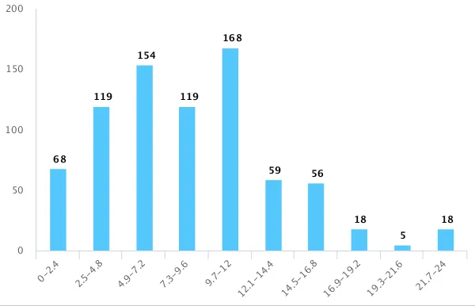

如今，网络已经成为我们生活中必不可少的存在。那么，它究竟对我们有多大影响？

<!--more-->

根据国际电信联盟的数据，近年来，网络使用者数量在急剧增加。截至到 2018 年，全球互联网使用者已经达到 **37 亿**，约占全球总人口的 **49%**！[^1]

根据我们的调查数据，在 790 名受访者中，接近一半的人认为自己已经离不开网络。

那么，这究竟是好还是坏？

## 一、网络的利与弊

网络的利与弊，应该说是同时存在的，任何一个新生事物的出现，必然要对社会有一定的冲击，这既有利于社会和文明的发展，同时也带来一些弊端。但是不是因为有弊端我们就要远离网络、拒绝网络呢？

### （一）网络的利

从最初只有少数人使用的 ARPANET，到蒂姆·伯纳斯–李发明万维网[^3]，使网络使用逐渐大众化，再到今天全球几十亿人使用网络，其发展更加迅速和多样化。在其发展的过程中，如果是弊端多于利处的话，也许现在就没有网络的存在了，它早已在弊端中消亡了。

而在我们调查的问卷中，不同年龄段的人对网络的利弊关系大多数都持积极或中立态度，只有极少数人认为网络弊大于利。

理由方面，大多数人都认为网络使生活更加便利，但也有很多人提出网络对个人自控力有很大的要求，使用正确会节约时间，反之则会浪费时间。

综合来看，网络的优点是明显的，如：

- 加快信息查询。
- 便捷现代通讯。
- 缩小世界范围……

在我们的调查中，这些优点都得到了充分体现。

### （二）网络的弊

有些人利用网络进行欺诈犯罪、不良信息传播等行为，此外，有些人上网方式不健康，体现在沉迷于网络游戏等方面，尤其是青少年，过多的把时间浪费在网络中，对身心都造成了伤害。网络还对我们的个人隐私造成了一定的侵害，如贩卖个人信息。

根据调查数据，个人每天使用网络的平均时长达到了 **8.64 小时**。

但网络有错吗？网络本身并没有错，它只不过是一个没有思想，没有感情的平台。正如一把刀，最初的产生一定是为了使生活更加便利，但有人却利用刀锋利这一特性来杀人，而刀本身又有什么错呢？错的是拿刀的人。网络的弊端，也同样是由于人的错误产生的。鲁迅先生有篇文章叫《拿来主义》，里面说道：

> “窗子打开的时候，进来的不只是新鲜的空气，也会有苍蝇和蚊子。”

而我们能做的，就是**取其精华，去其糟粕**。

综上所述，网络对个人及社会的影响是利大于弊的。

## 二、不同人群应如何正确地使用网络？

### （一）普通用户

- 未成年人

  网络对于当今接受力极强的青少年而言，影响最大，最直接的影响是各种各样的网络游戏。从积极方面看，网络游戏可以起到舒缓学习压力，充实课余生活和锻炼应变能力的作用，精心设计的网络游戏不但可以成为儿科治疗和康复的工具，甚至还可以成为青少年的良师益友，有助于他们的个性发展和全面成长。很多沙盘类游戏更可以锻炼儿童的空间感并增长他们的科学知识。

  从积极方面来看，网络使青少年的学习方式更加独立和自主。在极具个性的网络时代，人们并非是被动式的资讯接收者，网络的互动性将促使学习方式由以往的被动接受式教育向主动摄取式学习演变；另一方面，网络的虚拟社群也会迫使学生试图建立自我认同感，扮演社会角色，这有助于在各种社会情绪之间确认自身的人格。

  但从消极方面来看，学生沉溺于网络的虚拟世界，而无法静心投入到学习中，许多学生甚至本末倒置，投入了更多的时间和钱财在网络上。

  所以，在一个对网络越来越依赖的时代里，家长和教师除了对孩子进行正常的教育外，还应该引导孩子熟悉网络，培养他们对网络的使用能力，还应该让他们了解网络上的基本礼仪，包括不发表攻击性的言论，不滥发电子邮件，发表意见和文章时应注意礼貌等。这样不但可以学会尊重别人，也可以避免一些不必要的争端和冲突的发生。总之，如何帮助学生尽早学会使用网络，减少由于网络负面影响所带来的损害，是保证学生健康成长和培养适应现代信息社会发展人才的必经之路。让我们的学校、家庭、社会联合起来，为了孩子身心健康的发展，让孩子远离网络伤害。不应一味地逃避，而应如同治水一样，疏通与堵塞并行，找到正确的解决方法，并颁布法律条文来约束，以建立符合未成年人特点和时代需求的体系。

- 中老年人群

  上网能帮助老人缓解老年的孤独感，预防老年痴呆，以及结交朋友。一项新的研究表明，玩战略性电脑游戏（如资源管理和规划游戏）可能有助于老年人保持智力、记忆、推理和多任务处理能力等。上网可以缓解精神压力。现代社会工作生活节奏都很快，很多人都更专注于自己的事业而忽视了对老年人群体的关爱。而游戏则可以丰富老年人的退休生活，排解空虚和孤独的不利情绪。经研究发现，在进行游戏的过程中，大脑处理手眼协调的工作能力得到提高，因此玩游戏可以预防诸如老年痴呆症这样的在手眼协调能力上存在障碍的脑部疾病。
  
  老年人在上网的同时，也可能会错信一些舆论，相信所谓的“养生秘笈”“官方信息”等。因此国家应加强监管，家庭也应引导老人对网络上的信息进行必要的辨别。

除了这些特殊人群外，其他人同样应该做到正确地使用网络。根据我们的调查，

- 健康
- 安全

这两点为众多人所关注。

健康包括身体和心理两方面，上网时间过长以及浏览网络上的不良信息都会对个人健康造成不良影响，这不仅需要个人的自控力和鉴别能力，也需要科技公司的改变，更需要国家的支持和控制。

对个人而言，安全方面的着重点在于对个人信息和隐私的保护，这不仅需要个人加强防范意识，还需要内容提供商秉持正确的观念。

### （二）传统企业

随着互联网的发展，很多传统企业面临着新的挑战。由于互联网的冲击，曾经线下的一片繁荣景象变得支离破碎。是否转型，如何转型，都让很多企业老板犹豫不前，不知道该如何抉择。而员工也会考虑是否需要跳槽到其他单位，同时许多人也因此失去工作。

这是时代发展的必然，企业所能做的，只有转型和创新。

### （三）内容提供商

一场题为[《如何能让更好的技术使我们不分心》](https://www.ted.com/talks/tristan_harris_how_better_tech_could_protect_us_from_distraction)的 TED 演讲中提到，设计者应该考虑“**Deeper human design goals**”（更深层次的人性化目标），这是一个有益于社会且富有建设性的创意，也就是说，提供内容提供商在考虑利益的同时，还应注重用户的体验和对社会的价值。

## 总结

在未来的生活中，网络也许会无处不在，所以，网络规范化、法制化就更需要被推进。这一过程需要社会中每一位公民做出贡献，使网络的自由与秩序并存，让其对人类社会的发展产生积极影响。

[^1]: [Statistics](https://www.itu.int/en/ITU-D/Statistics/Pages/stat/default.aspx)
[^2]: [Jeff Ogden (W163) and Jim Scarborough (Ke4roh)](https://commons.wikimedia.org/wiki/File:Internet_users_per_100_inhabitants_ITU.svg), [CC BY-SA 3.0](https://creativecommons.org/licenses/by-sa/3.0), via Wikimedia Commons
[^3]: [互联网 - 维基百科，自由的百科全书](https://zh.wikipedia.org/wiki/互联网)
