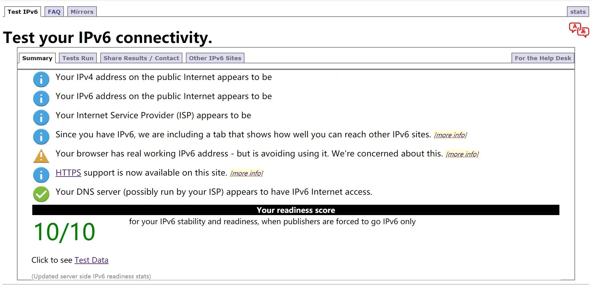

不是标题党！不是标题党！不是标题党！

真的没有想到，IPv6 竟在你我身边。

<!--more-->

事情其实是这样的：最近正折腾某家的免费纯 IPv6 的 VPS，移动数据有 IPv6 我是知道的，但是家宽也有我却不知道。折腾的时候我还以为家里是纯 IPv4 的，于是经过各种搜索、学习和测试，发现如果有一台双栈的 VPS，就可以实现 IPv4 和 IPv6 之间的互通。

实验是成功了，那么如何搭建这样的一个透明网关呢？是不是需要局域网内分配 IPv6 地址？这时忽然想起来家里的小米路由器管理界面里面有一个开启 IPv6 的选项，于是便试着将其打开。意想不到的事情发生了，哇，竟然获取到了公网的 IPv6 地址！通过 [test-ipv6.com](http://test-ipv6.com) 的测试，成功得到了 10/10 的完美成绩。又经过访问中科大镜像站 IPv6 线路，以及 SSH 远程登陆纯 IPv6 主机，证明我的确可以访问 IPv6。

好吧，是我火星了。

## IPv6 的简单介绍及其特点

IPv6 与 IPv4 的确有很大的不同，如地址格式（这不是废话嘛）和地址分配。我进行了一些粗略的学习，这里简单地谈一谈我的理解。[^1]

### 一、产生原因

为什么会产生 IPv6？IPv4 它不好吗？这个问题的主要答案就在于地址的数量上。截至 2018 年 1 月，全球上网人数已达 **40.21 亿**，而 IPv4 仅能提供约 **42.9 亿**个地址。[^2]

显然，并不是每个人只用一台终端上网，而从 IPv4 本身来说，很多特殊地址块需要从中排除，最终的可用数量大概是 36.47 亿。

世界人口的数量仍在不断增长，随着生活水平的提高，越来越多的人正在学会上网；同时，随着 IoT、5G 等新技术的出现，人均网络终端量也会同步增加，这意味着，IPv4 地址真的不够用了。

也许你并没有感受到这一切，但实际上，IPv4 地址数量的不足已经给我们的日常网络使用造成了一定的影响。在中国，除非特别购买，你的公网 IPv4 地址都是动态分配的，其好处在于当一台终端离线时就把其地址分给其他上线的终端。更有一些地区不提供公网 IPv4 地址，而是使用 NAT 技术，让整个地区都处于一个大的局域网之中，这就导致许多网络服务的访问故障以及断网现象。

据统计，美国有 1,541,605,760 个 IPv4 地址，人口有 313,847,465 人，平均下来每千人分配到的 IPv4 地址数为 **4,911.96**；而中国在人口数为 1,343,239,923 的情况下却只有 330,321,408 个 IPv4 地址，每千人只能分配到可怜的 **245.91** 个 IPv4 地址。[^4]迫不得已，运营商们也只能通过 NAT 一层一层地进行着地址的分配，使如此多的终端都能连上互联网。

为了解决以上的种种问题，IPv6 应运而生。

### 二、地址格式

为了解决 IPv4 地址数量不足的问题，IPv6 地址的位数由 IPv4 地址的 32 位增至 128 位，即地址总数为 2^128^，[^2]展开就是：

340,282,366,920,938,463,463,374,607,431,768,211,456

这个数量相当于 6 兆多瓶 550 mL 的农夫山泉中所含的原子个数！

### 三、特殊地址

| IPv4                                          | IPv6              |
| --------------------------------------------- | ----------------- |
| 0.0.0.0/32                                    | ::/128            |
| 127.0.0.0/8                                   | ::1/128           |
| 169.254.0.0/16                                | fe80::/10         |
| 10.0.0.0/8 172.16.0.0/12 192.168.0.0/16 | fc00::/7          |
| x.x.x.x/0                                     | ::ffff:x.x.x.x/96 |

### 四、临时地址

在 IPv4 时代，NAT 被广泛使用，家庭中一般只有路由器会直接连接到公网。由于 IPv6 地址数量庞大，可以做到每一台设备都拥有 IPv6 公网地址并直接连接到公网，这会增加设备受到攻击的概率；此外，SLAAC 生成的 IP 地址基于 MAC 地址，也就是说，如果知道了某台设备的 IPv6 地址，就有可能算出其 MAC 地址。所以为保证安全，系统会另外随机生成临时 IPv6 地址，这种地址生命周期短。[^5]

## 总结

在这之前，我一直认为 IPv6 是一个离我很远的东西，没想到，它也许早都在我身边了。以前的旧 TP-LINK 路由器不支持 IPv6，而新的小米路由器虽然有，我却一直没有在意。于我而言，IPv6 几乎就是新的概念。

我想这也不能单纯怪我不去了解新的技术，事实上，IPv6 距普及还有很大距离，连 GitHub 这种网站都不支持 IPv6，这在配置纯 IPv6 VPS 的时候造成了一些麻烦。我认为，IPv6 迟迟没有普及的很大原因就是因为其被感知度低，一般消费者并不会因为产品使用了所谓的 IPv6 而感到如何不同，但像 5G 这种技术就可以带来在速度与延迟上很明显的感知。也许，IoT 会成为 IPv6 普及的突破口之一。

接下来，我会继续研究关于 IPv6 的知识。博客方面，我准备撰写 V2Ray 透明代理以及 Dnsmasq 与 DoH 的一些经验教程，尽请期待。

最后的最后，除了文章开头提到的 IPv6 测试网站，[The KAME project](http://www.kame.net/) 也可以检验你的设备是否有可用的 IPv6 网络，当存在时，原本静止的小乌龟将会游动起来。

[^1]: [IPv6系列-入门指南](https://www.jianshu.com/p/7eb55d60561f)
[^2]: [IPv6 - 维基百科，自由的百科全书](https://zh.wikipedia.org/wiki/IPv6)
[^3]: [World Population Clock: 7.8 Billion People (2020) - Worldometer](https://www.worldometers.info/world-population)
[^4]: [各国IPv4地址分配列表 - 维基百科，自由的百科全书](https://zh.wikipedia.org/wiki/各國IPv4位址分配列表)
[^5]: [家里开通 ipv6 了， 为什么有 3 个 ipv6 的地址 - V2EX](https://www.v2ex.com/t/492004)