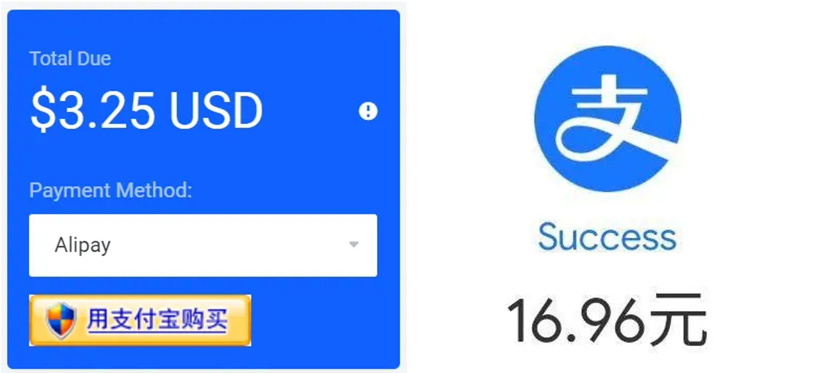

随着网络技术的飞速发展，各种云存储服务层出不穷。众所周知，由于国内现状，很多服务并不可靠，所以，搭建一个属于自己的云存储是有必要的。

<!--more-->

## 一、购买

听闻 BuyVM（即 FranTech）的 VPS 可以挂载块存储，G 口，而且价格便宜，就入手体验了一下，用来搭建个人云存储和离线下载。

[FranTech 官网](https://my.frantech.ca)进入之后选择“Order Hosting”，页面的左边是产品分类，这里需要分别购买 VPS 和块存储。

不过这时你很可能会因为缺货而无法购买，据了解，每月 10 号左右会补货[^1]，每天凌晨 1 点左右也会补货[^2]。（所以 10 号 1 点左右补货的概率比较大？）

商家支持多种方式付款，其中使用支付宝付款时（其他方式不清楚），虽然页面上标识的货币单位是 USD，但实际上却以 CAD 加元的汇率进行换算。以下图片是我本月续费的价格，我所购买的是最低档的配置。



1 CAD = 5.21 CNY (Jul 22, 11:37 UTC)，如此来看，这个价格已经相当便宜了。

## 二、安装和配置系统

购买后，用户需要手动到 [Stallion](https://manage.buyvm.net) 后台面板安装系统。该面板功能很多，尤其是系统这里，不仅提供 Debian、Ubuntu、CentOS、Fedora 这些主流发行版的多个版本的自动重装服务，还提供了包括 Windows 和 BSD 在内多种系统的 ISO 镜像，供用户手动安装。这里我安装了 Ubuntu 20.04。

另外在购买完成后，后台面板的登录信息会自动发送到你的邮箱中，如果未收到请检查垃圾邮件箱。

### （一）网络配置

系统安装完成后就可以进行其他配置了。在面板的 Networking 中（VPS 下的那个，不是页面顶部的那个），可以免费添加多个 IPv6 地址。

添加后 SSH 登录到 VPS，修改 `/etc/netplan/01-netcfg.yaml`。[^3][^4]

```yaml
network:
    version: 2
    renderer: networkd
    ethernets:
        eth0:
            dhcp4: false # 静态地址，解决自动获取地址时间长的问题
            dhcp6: false # 必须静态地址
            addresses:
                - 205.x.x.x/24 # IPv4 地址，按实际情况填写
                - "2605:x::1/48" # IPv6 地址，按实际情况填写
            gateway4: 205.x.x.1 # IPv4 网关，按实际情况填写
            gateway6: "2605::1" # IPv6 网关，按实际情况填写
            nameservers:
                addresses:
                    - 8.8.8.8
                    - 2001:4860:4860::8888
                    - 8.8.4.4
                    - 2001:4860:4860::8844 # DNS 地址，按个人喜好填写
```

保存退出，执行

```shell-session
# netplan apply
```

这时 SSH 可能会无响应，稍等片刻，等待网络配置完成即可。

编辑 `/etc/sysctl.conf`。

```ini
…
net.core.default_qdisc = fq
net.ipv4.tcp_congestion_control = bbr
```

保存后运行

```shell-session
# sysctl -p
```

以开启 BBR。

### （二）块存储配置

接下来就是挂载块存储了，首先需要在面板中将块存储添加到 VPS 中，然后在 VPS 中对其进行分区、格式化后挂载。

```shell-session
# fdisk /dev/sda # 正常来说都会显示为 sdX。
```

此时会进入 fdisk 的命令界面，首先输入 `o` 创建 MBR 分区表，之后输入 `n` 创建分区，最后输入 `w` 进行保存。具体操作方式请自行阅读软件提示或查找相关资料。

之后输入

```shell-session
# mkfs.ext4 /dev/sda1
```

进行分区格式化。再更改 `/etc/fstab` 文件进行挂载配置。[^5]

```
/dev/sda1 /home ext4 defaults 0 0 # 这里我选择将块存储挂载到整个 /home 目录。
```

```shell-session
# mount /dev/sda1 # 由于已经配置了 fstab 文件，所以使用 mount 指令时无需指定其他参数。
$ df -h # 查看挂载情况。
```

### （三）用户配置

由于需要使用 `/home` 目录，也为了增加安全性，顺便新建一个用户。这里将“steve”作为新用户的名称。[^6][^7]

```shell-session
# useradd -m -G sudo -s /bin/bash steve # 创建 steve 用户，创建用户主目录，将 steve 添加到 sudo 用户组以使用 sudo 指令，将 bash 作为其默认 shell。
# passwd steve # 为 steve 用户设定密码。
```

执行 `su - steve` 或 `sudo -i -u steve` 指令或使用新用户名称登录即可切换用户。

## 三、安装 Cloudreve 配置个人云存储

[Cloudreve](https://github.com/cloudreve/Cloudreve) 是一款使用 Go 语言编写，支持多家云存储驱动的公有云文件系统。相比于 Nextcloud、ownCloud、Seafile 这些比较老牌的云存储系统，Cloudreve 更加简洁、轻便、迅速、开箱即用，同时支持本机、从机、七牛、阿里云 OSS、腾讯云 COS、又拍云、OneDrive（包括世纪互联版）作为存储端，还可以对接 aria2 实现离线下载，非常符合我的个人需求。[^8]

搭建之前建议**仔细**阅读[官方文档](https://docs.cloudreve.org)，我的步骤只是在比较理想的情况下的一种方案记录而已，但每个人的实际情况不同，所以在配置过程中难免会出现大大小小的问题，这时仔细阅读程序的官方文档不失为一种有效的问题解决方法。

演示环境为 Ubuntu 20.04，Cloudreve 相关文件会储存在用户主目录下的 `cloudreve` 文件夹中。

```shell-session
$ cd
$ mkdir cloudreve
$ cd cloudreve/
$ wget https://github.com/cloudreve/Cloudreve/releases/download/3.x.x/cloudreve_3.x.x_linux_amd64.tar.gz # 最新版本请访问该 GitHub 项目仓库的发布页。
$ tar -xvf cloudreve_3.x.x_linux_amd64.tar.gz
$ rm cloudreve_3.x.x_linux_amd64.tar.gz
$ ./cloudreve
```

第一次运行成功后会显示管理员用户名和密码（**请务必进行记录**）并生成配置文件。此时访问 `http://服务器 IP 地址:5212` 会进入到 Cloudreve 登录界面，输入记录的用户名和密码就会进入文件管理页面。如果运行成功，停止 Cloudreve 程序，配置 systemd 进程守护。[^9]

创建 `/etc/systemd/system/cloudreve.service`。

```ini
[Unit]
Description=Cloudreve
Documentation=https://docs.cloudreve.org
After=network.target
Wants=network.target

[Service]
User=steve
WorkingDirectory=/home/steve/cloudreve/
ExecStart=/home/steve/cloudreve/cloudreve
Restart=on-abnormal
RestartSec=5s
KillMode=mixed

StandardOutput=null
StandardError=syslog

[Install]
WantedBy=multi-user.target
```

```shell-session
# systemctl enable cloudreve --now
```

## 四、安装 aria2 配置离线下载

### （一）配置 aria2

aria2 在 Ubuntu 官方源里面就有，直接安装即可。

之后在 `/home/steve/.aria2/` 下创建 aria2 需要使用的文件并编辑 `aria2.conf`。[^10][^11][^12]

```shell-session
$ cd
$ mkdir .aria2
$ cd .aria2/
$ touch aria2.conf aria2.session dht.dat dht6.dat
$ vim aria2.conf
```

```ini
enable-rpc=true
# RPC 授权密钥令牌，防止他人使用你的 aria2，如需要请在下文 Cloudreve 和 AriaNg 对应处进行填写
# rpc-secret=<token>

dir=/home/steve/downloads/
continue=true
save-session=/home/steve/.aria2/aria2.session
save-session-interval=30
input-file=/home/steve/.aria2/aria2.session

file-allocation=none
remote-time=true
content-disposition-default-utf8=true
max-connection-per-server=16
min-split-size=1M
split=16
http-accept-gzip=true
```

之后创建文件 `/etc/systemd/system/aria2.service`。

```ini
[Unit]
Description=aria2

[Service]
ExecStart=/usr/bin/aria2c
Restart=on-abnormal
RestartSec=5s
User=steve

[Install]
WantedBy=multi-user.target
```

```shell-session
# systemctl enable aria2 --now
```

### （二）配置 Cloudreve

登录 Cloudreve 管理员账号，点击右上角用户头像 -> “管理面板” -> “参数设置” -> “离线下载”，修改参数。

```
RPC 服务器地址
http://aria2.example.com:6800

RPC Secret
如在 aria2.conf 中设置请填写，否则留空即可。

临时下载目录
/home/steve/downloads/

状态刷新间隔 (秒)
1
```

修改完毕后点击“测试连接”，如提示“连接成功”则点击“保存”即可。[^13]

### （三）配置 AriaNg

至此，主要目标已经实现，但想要更好地使用 aria2，就需要安装网页前端面板，这里使用 [AriaNg](https://github.com/mayswind/AriaNg)。

```shell-session
# apt install unzip
# mkdir /srv/ariang
$ cd /srv/ariang/
# wget https://github.com/mayswind/AriaNg/releases/download/1.x.x/AriaNg-1.x.x.zip # 最新版本请访问该 GitHub 项目仓库的发布页。
# unzip AriaNg-1.x.x.zip
# rm AriaNg-1.x.x.zip
```

安装后，配置网站服务器（具体步骤见下文）并从浏览器访问该面板，点击“AriaNg Settings”->“RPC (aria2.example.com:6800)”并按照配置 Cloudreve 离线下载的步骤对面板进行配置即可。

## 五、安装 Caddy 配置网站和反向代理服务器

为了易用性和安全性，这里使用 Caddy 2 作为网站和反向代理服务器。安装方法请访问[官网](https://caddyserver.com)。

编辑 `/etc/caddy/Caddyfile` 并重启服务。[^14]

```Caddyfile
cloud.example.com {
    encode zstd gzip
    reverse_proxy 127.0.0.1:5212
}

aria2.example.com {
    encode zstd gzip
    reverse_proxy /jsonrpc 127.0.0.1:6800
    root * /srv/ariang/
    file_server
}
```

访问 `https://cloud.example.com` 和 `https://aria2.example.com` 可分别进入 Cloudreve 和 AriaNg。另外，需要分别将 Cloudreve 离线下载和 AriaNg 中配置的 RPC 地址改为 `https://aria2.example.com:443` 才可以正常使用 aria2。

提示：当使用 HTTPS 协议访问 AriaNg 时，面板配置中的 RPC 协议也只能选择 HTTPS 或 WebSocket（安全）。

[^1]: <https://t.me/zhenggui/851209>
[^2]: [Frantech购买Block Storage Slabs,BuyVM挂载存储盘方法教程! 256G只要1.25美元_猪机博客](https://www.pigji.com/472.html)
[^3]: [Netplan | Backend-agnostic network configuration in YAML](https://netplan.io)
[^4]: [kvm [Frantech/BuyVM Wiki]](https://wiki.buyvm.net/doku.php/kvm)
[^5]: [fstab - ArchWiki](https://wiki.archlinux.org/title/Fstab)
[^6]: [Users and groups - ArchWiki](https://wiki.archlinux.org/title/Users_and_groups)
[^7]: [在 Ubuntu 中如何将用户添加到 Sudoers - 云+社区 - 腾讯云](https://cloud.tencent.com/developer/article/1626193)
[^8]: [cloudreve/Cloudreve: 🌩支持多家云存储的云盘系统 (Self-deployed file management and sharing system, supports multiple storage providers)](https://github.com/cloudreve/Cloudreve)
[^9]: [快速开始 - Cloudreve](https://docs.cloudreve.org/getting-started/install)
[^10]: [aria2c(1) — aria2 1.36.0 documentation](https://aria2.github.io/manual/en/html/aria2c.html)
[^11]: [安装Aria2+AriaNg – 海天无影Blog](https://blog.haitianhome.com/install-aria2-web-ariang.html)
[^12]: [请问如何允许 aria2 多线程下载? - V2EX](https://www.v2ex.com/t/645881)
[^13]: [离线下载 - Cloudreve](https://docs.cloudreve.org/use/aria2)
[^14]: [The Caddyfile — Caddy Documentation](https://caddyserver.com/docs/caddyfile)