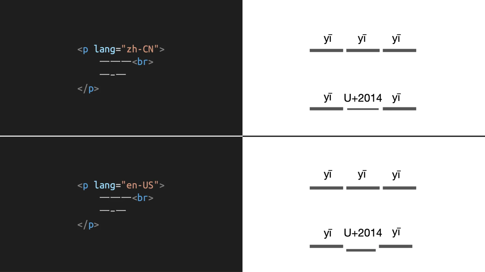
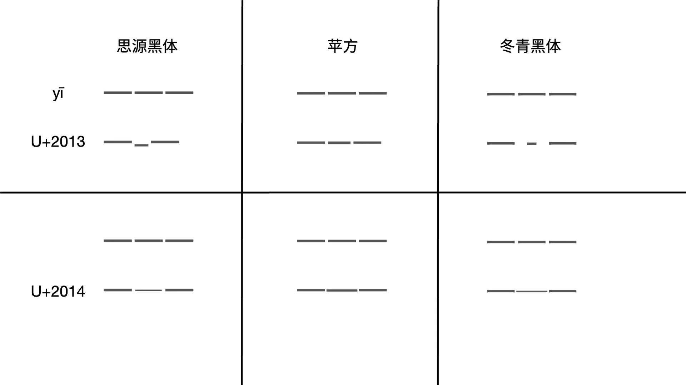

为了提高博客的阅读体验，我对博客的字体设置进行了一系列的调整，此文章旨在记录确定此方案时的思路历程。

<!--more-->

## 问题

字体设置中遇到的最大问题在于中文内容夹用英文时，某些中文或英文标点符号在 Unicode 字符集中处于同一码位而导致其位置、书写形式不规范。除此之外，还应保证在各种环境下博客字体显示体验良好。

## 参考网站

在确定方案之前，不如先看看一些具有代表性的网站的字体是如何设置的。

- [Apple](https://www.apple.com.cn/)：

```css
font-family: "SF Pro SC","SF Pro Text","SF Pro Icons","PingFang SC","Helvetica Neue","Helvetica","Arial",sans-serif;
```

作为 macOS/iOS 的官网，这里首先使用 San Francisco 字体，并且为网络字体，SF Pro SC 是优化后的苹方，三个 SF 字体分别负责中文、英文、特殊符号。总体来看，中文字体优先级高于英文字体。

- [Microsoft](https://www.microsoft.com/zh-cn):

```css
font-family: 'Segoe UI',SegoeUI,'Microsoft YaHei',微软雅黑,"Helvetica Neue",Helvetica,Arial,sans-serif;
```

Windows 操作系统官网则使用 Segoe UI 和 微软雅黑作为其首选字体，其中前者为网络字体。英文字体优先级高于中文字体。

- [Android](https://www.android.com/intl/zh-CN_cn/):

```css
font-family: Roboto,Noto Sans SC,Helvetica,Arial,sans-serif;
```

Android 操作系统官网使用 Roboto 和思源黑体作为首选字体，两者均为网络字体。英文字体优先级高于中文字体。

- [知乎](https://www.zhihu.com)：

```css
font-family: -apple-system,BlinkMacSystemFont,Helvetica Neue,PingFang SC,Microsoft YaHei,Source Han Sans SC,Noto Sans CJK SC,WenQuanYi Micro Hei,sans-serif;
```

作为大型中文社交平台，知乎就没有上面几个操作系统官网那么有个性，而是保持较大的兼容性。总体来看，macOS 字体优先于 Windows 字体优先于 GNU/Linux 字体，同时英文字体优先于中文字体。

总结一下，各大操作系统官网为了彰显自己的个性而使用网络字体，而知乎则以兼顾更多用户为准则。此外，英文字体大多优先于中文字体，这是因为中文字体中往往会携带英文字体，如果提高中文字体优先级，英文字体就不会被使用。但这样做就会造成位于同一码位的英文标点符号优先级高于中文标点符号，导致这些中文标点符号显示不规范。实际上，Apple 的 SF Pro SC 中就不含有英文字体[^1]，所以它和其他网站不同。另外，对于一些大型字体家族（如 Noto），中文字体中所含的英文字体同样显示体验良好。

## 标点符号

- 句号、问号、叹号、逗号、顿号、分号、冒号、括号、间隔号、书名号和分隔号（分隔号与英文中的斜杠形式相同）[^2]有独立码位，无需讨论。
- 着重号、专名号：不常用，暂不讨论。
- 引号：引号分双引号和单引号，常用的形式为弯引号。但由于和英文中的引号形式相同，位于同一码位，但所占空间不同（中文中占一个字位置，英文占半个字），需要依靠字体来控制显示效果。这个问题最简单的解决方法是改用直角引号，即「「」」和「『』」。[^3]
- 破折号：「破折号标在相应项目之间，占两个字位置，上下居中，不能中间断开分处上行之末和下行之首。」[^4]多数人会使用两个连续的 U+2014 EM DASH「—」来代表破折号，但这样做最大的问题在于破折号明明是一个单独的符号，却需要通过两个符号来拼凑。[^5]W3C《中文排版需求》中推荐使用占两个汉字宽度的 U+2E3A TWO-EM DASH「⸺」，但又加了一句「通常也使用两个连续的 U+2014 EM DASH『—』来实现」。[^6]事实上，想要破折号显示规范，还需要看字体如何实现。在思源黑体中，当字体区域为中日韩时，两个连续的 U+2014 EM DASH「—」、两个连续的 U+2015 HORIZONTAL BAR 「―」和一个 U+2E3A TWO-EM DASH「⸺」会展现同样的效果。综上所述，使用一个 U+2E3A TWO-EM DASH「⸺」可能是最恰当的。[^5][^7]
- 省略号：省略号应上下居中，但由于中文和英文的省略号位于同一码位，而英文中的省略号应处于下部，所以其样式应通过字体进行控制。另外，省略号和目前常用的破折号输入方法一样，是通过同时输入两个连续的 U+2026 HORIZONTAL ELLIPSIS「…」实现的，只不过影响不大，可以接受。
- 连接号：连接号分为短横线「–」、一字线「—」、浪纹线「～」三种，其中浪纹线拥有独立码位，无需讨论。而按照 W3C《中文排版需求》的推荐，短横线和一字线应分别使用 U+2013 EN DASH「–」和 U+2014 EM DASH「—」[^6]，这种思路显然是以「连接号中的短横线比汉字『一』略短，占半个字位置；一字线比汉字『一』略长，占一个字位置……」[^4]中规定的形式为基础，而不是以 Unicode 中符号本身的含义为基础。虽然相似，但在长度和位置方面仍不规范。

  

  奇怪的是，在思源黑体中，除了 U+2014，其他横线样式的符号只在韩文中做了处理。[^7]另外，即使是 U+2014 也不完全符合规范。经过测试，苹方的表现较好。

  

## 结论

在研究过程中，我发现思源黑体非常强大。在中文内容夹用英文时，往往要同时使用中文和英文的标点符号，想要保证规范性，就要引入两套字体。但思源黑体使用了 OpenType GSUB locl 特性，在 HTML 标签中指定 `lang` 属性就可以实现不同语言使用不同形式的标点符号。[^5][^7]但在实际测试中，该特性有时不起作用。

综上所述，我决定将思源黑体作为首选字体，并在缺少本地字体时进行网络字体加载，之后再添加一些字体作为网络字体未加载时的回落。对于 `lang="en-US"` 的元素，独立使用一套字体。[^8][^9]

```css
body {
    font-family: "Noto Sans CJK SC", "Source Han Sans SC", "Source Han Sans CN", "Noto Sans SC", "PingFang SC", "Microsoft YaHei", sans-serif;
}

:lang(en-US) {
    font-family: "Helvetica Neue", Roboto, "Segoe UI", SegoeUI, Helvetica, Arial, sans-serif;
}
```

[^1]: [SF Pro SC 是什么字体？ | by Pudge | Medium](https://pudge1996.medium.com/what-is-sf-pro-sc-b903b828bb50)
[^2]: [标点符号 - 维基百科，自由的百科全书](https://zh.wikipedia.org/wiki/标点符号)
[^3]: [别再用「六个点」当省略号了，这些标点都有更规范的输入方式 - 少数派](https://sspai.com/post/45516)
[^4]: [中华人民共和国国家标准，《标点符号用法》（GB/T 15834–2011）](http://c.gb688.cn/bzgk/gb/showGb?type=online&hcno=22EA6D162E4110E752259661E1A0D0A8)
[^5]: [The Type — 文字 / 设计 / 文化 » 不离不弃的破折号](https://www.thetype.com/2019/03/14918/)
[^6]: [Requirements for Chinese Text Layout中文排版需求](https://www.w3.org/TR/clreq/)
[^7]: [思源黑体官方自述文件](https://raw.githubusercontent.com/adobe-fonts/source-han-sans/release/SourceHanSansReadMe.pdf)
[^8]: [中文网页字体设置方案：从 font-family 到 font-display – RidiQulous](https://ridiqulous.com/chinese-webfont-guide/)
[^9]: [:lang - CSS（层叠样式表） | MDN](https://developer.mozilla.org/zh-CN/docs/Web/CSS/:lang)