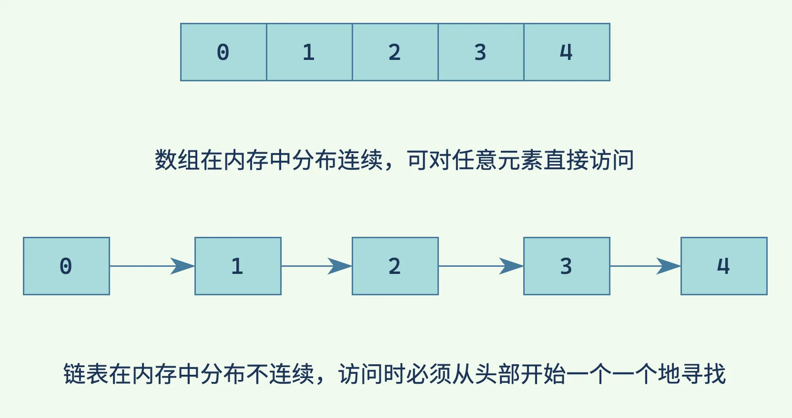
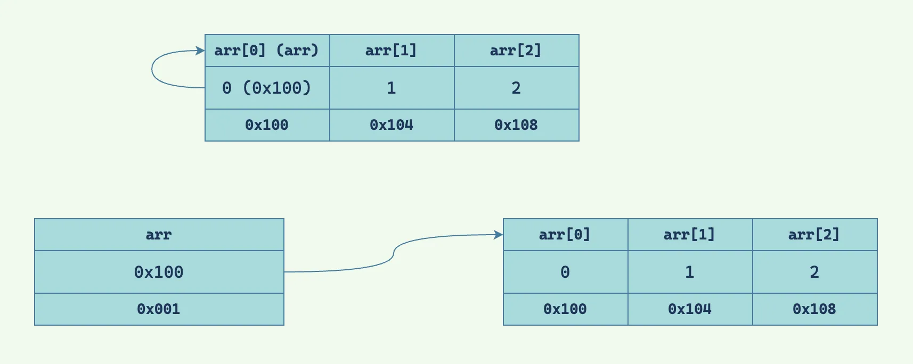

内存与数据结构密不可分。

<!--more-->

这个系列将分为三篇文章，第一篇分析 C 中原始数组的不足，第二篇将编写一个更加完善、更多功能的数组类型，第三篇对链表进行讲解。

## 数组

数组（array）是编程中一种常用的数据结构，其特点为其中的元素类型相同、内存中存储连续、可通过索引进行随机访问。[^1]然而 C 中的数组十分简陋，与原始指针几乎别无二致。

> **什么是「随机访问」？**[^2]
>
> 所谓「随机」可以理解为直接、任意，如访问数组时只需指定其索引即可访问，与之相对的是链表（之后会提到）等循序访问[^3]的数据结构，访问时须一个接着一个地找到目标。
>
> 

## 数组的本质是指针

看下面一段代码：

```c
#include <stdio.h>

int main(void) {
  const int arr[] = {0, 1, 2, 3, 4};
  printf("elements in arr: ");
  for (int i = 0; i < 5; i++) {
    printf("%d ", arr[i]);
  }
  putchar('\n');
  printf("arr: %p\nthe address of arr: %p\n", arr, &arr);
  return 0;
}
```

有以下输出：

```
elements in arr: 0 1 2 3 4
arr: 0xfffffffff680
the address of arr: 0xfffffffff680
```

接下来使用 LLDB 进行调试并输入命令 `memory read --size 4 --format x &arr`，得到以下输出：

```
0xfffffffff680: 0x00000000 0x00000001 0x00000002 0x00000003
0xfffffffff690: 0x00000004 0x0000ffff 0xf7e373c0 0x00000000
```

首先来看程序本身的输出，第一行表示的是数组 `arr` 中含有的元素，第二行是变量 `arr` 中含有的内容，第三行是变量 `arr` 所在的内存地址……等等，为什么 `arr == &arr`？

我们再来看看调试器的输出。这段输出代表的是变量 `arr` 附近的内存布局。冒号之前是地址，冒号之后是内存中存储的内容，每个十六进制数表示的是 4 bytes（一个 int 类型）的数据。从这里能够很明显的看出数组在内存中存储连续这一特点，`0`、`1`、`2`、`3`、`4`，每个元素都是紧挨着的。

接下来讨论一下为什么 `arr` 中的内容是本身的地址，这恰恰揭示了数组的本质⸺一个指向数组首元素地址的指针，与众不同的是，这个指针和它所指向的内容处于同一位置。听起来有点绕，让我们看一张图。



图中的上半部分就是数组在内存中的存储形式，实质占空间的只有 `arr[0]`、`arr[1]`、`arr[2]` 三个元素，而 `arr` 这个指针只是 C 中的一个特殊处理，它仿佛是一个幽灵，看似存在但在内存中却不占空间，这一点在上文的调试器输出中可以得到验证。

这样做的好处是节省了一个指针所占用的空间以及分配它所需要的时间，图中的下半部分就是额外分配空间用以存储首元素地址在内存中的形式。

## C 中数组的不足

### 无越界检查

论不足，无越界检查一定是最令人难受的，这一点直接影响了 C 的安全性，其本质问题在于 C 中的数组并没有长度属性，而这些功能在其他语言中已经是标配，包括 C++。

```cpp
#include <array>
#include <iostream>

int main() {
  const std::array arr{0, 1, 2, 3, 4};
  for (auto i = 0UL; i < arr.size() + 1; i++) {
    std::cout << arr.at(i) << "\n";
  }
  return 0;
}
```

这段代码在运行时会抛出 `std::out_of_range` 的异常，而不是继续读取。

> **C++ 和 C 的数组不一样？**
>
> 是的，准确来说，现代 C++ 与 C 的数组不同。千万不要认为 C 和 C++ 是一种语言，只不过 C++ 基于 C，所以兼容很多 C 的语法与特性。实际上，C 中的很多东西在如今的 C++ 中都有了更加完善的替代品，这其中就包括数组。从 C++11（C++ 的版本）开始，C++ 中添加了众多新的特性，与 C 有了明显的差别，从此往后的 C++ 被称为「现代 C++」。

### 不能动态分配

这一点和下一点并不是 C 的缺陷，对于 C、C++、Rust 等在栈中分配数组空间的语言，数组大小需要在编译期确定。而对于 Java、C#、Kotlin 等在堆中分配数组空间的语言，数组大小在运行期确定。

> **什么是「编译期」、「运行期」？**
>
> 从源代码变成二进制程序需要由编译器进行编译，在编译期间进行的行为被称为编译期行为；类似的，程序运行期间进行的行为被称为运行期行为。
>
> 所谓「数组大小需要在编译期确定」通俗来说就是定义数组时指定的长度必须是一个数，而不能是变量。
>
> ```c
> int arr[5];
> ```
>
> 这里的「`5`」也可以用宏进行替换。
>
> ```c
> #define Length 5
> int arr[Length];
> ```
>
> 但不可以是变量，即使是用 `const` 修饰的变量也不行，因为 `const` 在 C 中的含义是**运行期**常量或不可变的变量。（这又是与 C++ 的不同。）
>
> ```c
> const int length = 5;
> int arr[length];
> ```
>
> 而「数组大小在运行期确定」的意思是定义数组时指定的长度可以是变量，我们用 Kotlin 举一个例子：
>
> ```kotlin
> val length = readln().toInt() // 输入一个数作为数组长度 length
> val arr = Array(length) { 0 } // 创建一个数组 arr，其长度为 length，并填充 0
> println(arr.joinToString())   // 输出 arr 中的所有元素
> ```
>
> 运行这段代码，当输入 `5` 时，输出为：
>
> ```
> 0, 0, 0, 0, 0
> ```
>
> 总结一下，数组大小需要在编译期确定时，只能用（编译期）常量指定数组长度；而数组大小在运行期确定时，就可以在程序运行时从外部输入一个数（变量）作为数组的长度。

> **什么是「VLA」？**
>
> 如果你对上面关于 C 的例子测试时会发现，即使定义数组时 `[]` 内填写变量也能正常使用，这是为什么呢？其实这就是 C99 时添加的一个新特性：[VLA](https://zh.wikipedia.org/wiki/可变长数组)（**v**ariable-**l**ength **a**rray，可变长数组）。之前说过，C 中定义数组时其长度必须在编译期确定，而 VLA 使得数组长度在运行期确定成为可能。
>
> 尽管这个特性看起来不错，但[并不建议使用](https://blog.joren.ga/vla-pitfalls)，实际上鲜有语言支持这一特性，包括 C++，即使是 C 自己也在 C11（C 的版本）将其规定为可选特性，各种编译器对它的支持也参差不齐，所以这篇文章的前提就是假设 VLA 不存在。
>
> 有趣的一点是，尽管 C# 的数组默认分配在堆上，但也支持将其动态地分配在栈上，也就是支持 VLA。
>
> ```csharp
> var length = int.Parse(Console.ReadLine()!);
> Span<int> arr = stackalloc int[length];
> Console.WriteLine(String.Join(", ", arr.ToArray()));
> ```
>
> 这段代码的功能和上面 Kotlin 类似，但原理却完全不同。

> **什么是「栈（stack）」和「堆（heap）」？**
>
> > **注意**：此处的「栈」和「堆」指内存区域，请勿与数据结构中的栈与堆混淆。
>
> 当我们在程序中定义变量时，程序会在内存中申请空间，用以存储变量。而根据分配方式的不同，变量会存储在栈和堆这两个特性不同的内存区域中。首先来看「栈」。
>
> ```c
> int stack(void) { // ---+
>   int a = 1;      //    |-> a 的存活区域
>   return a;       // ---+
> }
>
> int a = stack();  // a 仍然存在？
> ```
>
> 变量 `a` 就是一个在栈上分配内存的变量，其生命周期（存活区域）为 `stack` 函数范围内，当生命周期结束时，编译器会自动将之前为 `a` 申请的内存空间释放，换句话说，当函数 `return` 后，`a` 就会被销毁。那么问题来了，为什么我们还能获取到 `stack` 函数的返回值呢？
>
> 这其实和函数传参机制类似。当传递参数到函数中时，参数会被复制一份，因此，如果把一个变量作为参数，无论在函数中如何修改这个变量，函数外的变量本身都不会受到影响。函数返回值也是同理，在 `a` 被销毁之前，其中存储的值被复制了一份，所以我们能够正确地获取到函数的返回值。
>
> 这个例子不够明显，让我们尝试在函数中创建一个数组并返回它。
>
> ```c
> #include <stdio.h>
>
> int* stack(void) {
>   int arr[] = {0, 1, 2};
>   return arr;
> }
>
> int main(void) {
>   int* arr = stack();
>   for (int i = 0; i < 3; i++) {
>     printf("%d ", arr[i]);
>   }
>   putchar('\n');
>   return 0;
> }
> ```
>
> 运行这个程序，得到一段诡异的结果。
>
> ```
> 0 65535 16
> ```
>
> 分析一下源代码，首先在 `stack` 函数中定义数组 `arr` 并初始化其中的元素为 `0`、`1`、`2`，之后返回 `arr`。由于 C 不支持函数返回数组类型，但前面说过，数组的本质是指针，所以这里返回指针类型。接下来在主函数中调用函数将主函数中的 `arr` 初始化，最后遍历 `arr` 输出每个元素。
>
> 这个例子很好地体现出栈中变量的特性，或许你在测试这段代码时得到看似正确的输出 `0 1 2`，但这就像越界访问数组元素一样，是未定义行为，是不可靠的，是错误的，没有人可以预知输出的结果正确与否。
>
> 实际上编译这段代码时，编译器会发出警告 `address of stack memory associated with local variable 'arr' returned`（与局部变量 `arr` 相关联的栈内存的地址被返回），虽然这句警告信息是废话文学的典型代表，但至少它提醒了我们不应这样做。
>
> 那么我们如何才能让程序按照预期执行呢？这个问题的本质在于，栈中变量的生命周期不够长，如果有一种方式能让我们自由地控制变量的生命周期就能够解决问题了。这就要用到在 `stdlib.h` 中声明的 `malloc` 函数，它的作用是在**堆**中申请指定大小的内存空间，并返回指向该空间地址的指针。接下来修改上面的代码。
>
> ```c
> #include <stdio.h>
> #include <stdlib.h>
>
> int* stack(void) {
>   int* arr = malloc(sizeof(int) * 3);
>   for (int i = 0; i < 3; i++) {
>     arr[i] = i;
>   }
>   return arr;
> }
>
> int main(void) {
>   int* arr = stack();
>   for (int i = 0; i < 3; i++) {
>     printf("%d ", arr[i]);
>   }
>   putchar('\n');
>   free(arr);
>   return 0;
> }
> ```
>
> 对比之前的代码，首先多引入了 `stdlib.h`，之后用到了 `malloc` 函数，它的参数只有一个，用来指定申请内存的大小，由于我们要存放三个整数，所以这里可以写 `12`（= 4 × 3），但这样容易写错，且不同环境下的 `int` 大小也有可能变化，所以用到了 `sizeof` 运算符⸺用以计算任意类型或表达式的所占内存大小。此外，`arr` 的类型需要从数组改为指针，而指针不能像数组一样初始化其中的元素，所以通过循环将 `arr` 中的每个元素赋值。
>
> 除此之外，程序结束之前多了一行 `free(arr);`，`free` 函数的作用是释放由 `malloc` 申请的内存，之前提到过，`malloc` 会在堆中申请内存，之后申请者就可以随意使用这些内存，但同时，申请者还需要在使用后手动释放他们，正所谓能力越大责任越大，只申请而不释放就是渣男行为⸺其后果是「内存泄漏」。
>
> 栈堆对比表[^4]：
>
> |                | 栈                         | 堆                         |
> | -------------- | -------------------------- | -------------------------- |
> | **管理者**     | 编译器                     | 开发者                     |
> | **申请方式**   | 编译器自动分配             | 开发者通过调用函数手动分配 |
> | **生命周期**   | 局部变量所在上下文的作用域 | 手动申请后，手动释放前     |
> | **可申请空间** | 小                         | 大                         |
> | **效率**       | 高                         | 低                         |

> **什么是「内存泄漏（memory leaks）」？**
>
> 正如上文所说，导致内存泄漏的原因是在堆中申请内存并使用后不对其进行释放，那么其后果是什么呢？
>
> 所谓内存泄漏的本质问题在于使用后的内存空间不能被重复使用。假设将一段视频读入内存中需要 100 MB 的内存空间，虽然需要的内存很多，但没有关系，只要用完之后将其释放，下一次操作仍可以使用这些内存，也就是说，该程序最大只会占用 100 MB 的内存（当然，我们假设每次只处理一段视频）；然而，如果在第一次操作后没有将内存释放，即使在程序运行逻辑上已经不需要内存中存储的数据了，但程序本身会认为这些数据仍被使用中，此时便会向操作系统继续申请 100 MB 的内存空间。随着这个操作的多次进行，程序的内存占用将急剧增加，达到一定阈（yù）值时，将触发操作系统的低内存机制，此时操作系统会**强制**结束程序运行并回收内存。很不幸，既然是强制结束运行，你刚刚花了好几个小时剪辑的视频成果就此消失。
>
> 内存泄漏会占用大量内存，同时处理多个视频也是如此，两者有什么区别呢？如果处理多个视频时出现内存不足，可以考虑对程序算法进行优化或对硬件进行升级（俗称加内存），这些问题终究能得到解决；而内存泄漏单纯的是程序的 bug，内存占用量会**无限**增加，无论如何优化算法或升级硬件都无法解决问题。
>
> 内存泄漏并不是非常严重的问题，但根据泄漏量的不同，随着时间的累积，问题就会爆发出来，造成很大影响，这些特性使内存泄漏在程序测试过程中难以被发现。尤其是在对稳定性要求极高的服务器程序上，这些程序通常二十四小时不间断运行，泄漏量很小，测试时越不容易发现问题，当程序在生产环境下运行一段时间后问题才被发现，此时便会对运营者造成损失。[^5]

> **垃圾收集（garbage collection）**
>
> 用 Kotlin 实现上面数组的例子：
>
> ```kotlin
> fun main() {
>     val arr = stack()           // 创建变量 arr，用函数 stack 的返回值将其初始化
>     println(arr.joinToString()) // 输出 arr
> }
>
> fun stack() = Array(3) { it }   // 创建函数 stack，返回值为一个长度为 3 的数组，初始化其中的元素为 0、1、2（不用管这是怎么做到的）
> ```
>
> 之前提到过，Kotlin 的数组在堆中存储，那么为何在程序结束前无需**手动**释放内存？
>
> 这就要归功于垃圾收集机制，该机制会**自动**利用收集器通过算法识别不再被使用的内存并对其进行回收，这大大减轻了程序员的心智负担，增强了程序的安全性。Java、C#、Kotlin、Go 等语言都原生具有垃圾收集机制。

### 不能增长

数组往往都是固定长度的，无论分配时的数组长度是变量还是常量，分配后数组长度就不能被改变，而能够自由增长的数组在各种语言中通常被称为 `List`、`ArrayList`、`Vector`、`Slice`，让我们用 Kotlin 举一个例子。

```kotlin
fun main() {
    val list = MutableList(5) { it }            // 创建一个列表 list，长度为 5，并初始化其中的元素为 0、1、2、3、4（不用管这是怎么做到的）
    println("list: $list length: ${list.size}") // 打印 list 的元素和长度
    list.add(5)                                 // 在 list 末尾添加新元素 5
    println("list: $list length: ${list.size}") // 打印 list 的元素和长度
}
```

```
list: [0, 1, 2, 3, 4] length: 5
list: [0, 1, 2, 3, 4, 5] length: 6
```

既然列表可以动态增长，由上面的分析可以推断，列表存储在堆中。所以 Kotlin 中的数组和列表本质相同，只是一个长度不可变，一个可变。

到这里，我们完成了对 C 中原始数组的分析并介绍了一些基本概念，下一篇文章将编写一个更加完善的数组类型，尽请期待。

[^1]: [数组 - 维基百科，自由的百科全书](https://zh.wikipedia.org/zh-cn/数组)
[^2]: [随机存取 - 维基百科，自由的百科全书](https://zh.wikipedia.org/zh-cn/隨機存取)
[^3]: [循序访问 - 维基百科，自由的百科全书](https://zh.wikipedia.org/zh-cn/循序存取)
[^4]: [什么是堆？什么是栈？他们之间有什么区别和联系？ - 知乎](https://www.zhihu.com/question/19729973)
[^5]: [既然每个程序占用的内存都是操作系统管理的，为什么内存泄漏还是个问题？ - 知乎](https://www.zhihu.com/question/400104113)
