VLESS 是一种很轻的协议，和 Trojan 一样，不对流量进行复杂的加密和混淆，而是大隐隐于市，通过 TLS 协议加密，混杂在其他 HTTPS 流量中，在墙内外穿进穿出。为了更好的伪装以应对主动探测，回落机制随 VLESS 同时出现。这篇教程将演示如何使用 Xray 中 VLESS 入站协议的回落机制配合 nginx 或 Caddy 在保证伪装完全的前提下实现按域名路由。

## 用途

除了上面提到的伪装以外，回落机制还解决了使用 XTLS 时其他服务无法运行在 TCP 443 端口的问题。同时，相比于其他路由方案，回落机制的性能更佳。[^1]

## SNI 简介

服务器名称指示（英语：**S**erver **N**ame **I**ndication，缩写：**SNI**）是 TLS 的一个扩展协议。在 TLS 握手过程中，服务器需要向客户端提供预期的 TLS 证书，[^2]然而服务器上常常会有不止一个证书，能够提供请求目标域名的 `Host` 头却只能在握手结束后得到，此时便出现了矛盾。解决方法是在 TLS 协商时，客户端同时发送目标域名，这就是 SNI。[^3]

## 思路



## 添加 DNS 记录


请按实际情况修改域名和 IP 地址。

## 申请 TLS 证书[^4]

首先在 [Cloudflare 管理面板](https://dash.cloudflare.com/profile/api-tokens)上创建 API Token，参数如下。（其他域名商请自行参考 [dnsapi · acmesh-official/acme.sh Wiki](https://github.com/acmesh-official/acme.sh/wiki/dnsapi)。）


权限部分至关重要，其他部分随意。

创建后，你会得到一串神秘字符，请将其妥善记录在安全且不会丢失的地方，因为它将不再会显示。这串字符就是即将用到的 `CF_Token`。

**注意**：以下操作请在 `root` 用户下执行，而不是使用 `sudo`。

```shell-session
# curl https://get.acme.sh | sh
# acme.sh --set-default-ca --server letsencrypt
# export CF_Token="sdfsdfsdfljlbjkljlkjsdfoiwje"
# acme.sh --issue -d example.com -d *.example.com --dns dns_cf -k ec-384
# mkdir -p /etc/ssl/acme/example.com
# acme.sh --install-cert -d example.com --fullchain-file /etc/ssl/acme/example.com/cert.pem --key-file /etc/ssl/acme/example.com/key.pem --reloadcmd "chown -R nobody:nogroup /etc/ssl/acme/example.com/ && systemctl restart xray" --ecc
```

## Xray 配置

以下配置主要针对 nginx。

```json
{
    "inbounds": [
        {
            "port": 443,
            "protocol": "vless",
            "settings": {
                "clients": [
                    {
                        "id": "UUID",
                        "flow": "xtls-rprx-direct"
                    }
                ],
                "decryption": "none",
                "fallbacks": [
                    {
                        "name": "example.com",
                        "path": "/vmessws",
                        "dest": 5000,
                        "xver": 1
                    },
                    {
                        "dest": 5001,
                        "xver": 1
                    },
                    {
                        "alpn": "h2",
                        "dest": 5002,
                        "xver": 1
                    },
                    {
                        "name": "blog.example.com",
                        "dest": 5003,
                        "xver": 1
                    },
                    {
                        "name": "blog.example.com",
                        "alpn": "h2",
                        "dest": 5004,
                        "xver": 1
                    }
                ]
            },
            "streamSettings": {
                "security": "xtls",
                "xtlsSettings": {
                    "certificates": [
                        {
                            "certificateFile": "/etc/ssl/acme/example.com/cert.pem",
                            "keyFile": "/etc/ssl/acme/example.com/key.pem"
                        }
                    ],
                    "rejectUnknownSni": true
                }
            }
        },
        {
            "listen": "127.0.0.1",
            "port": 5000,
            "protocol": "vmess",
            "settings": {
                "clients": [
                    {
                        "id": "UUID"
                    }
                ]
            },
            "streamSettings": {
                "network": "ws",
                "wsSettings": {
                    "acceptProxyProtocol": true,
                    "path": "/vmessws"
                }
            }
        }
    ],
    "outbounds": [
        {
            "protocol": "freedom"
        }
    ]
}
```

### 注意事项

#### Proxy Protocol

Proxy Protocol 是 HAProxy 开发的一种旨在解决代理时容易丢失客户端信息问题的协议，常用于链式代理和反向代理。[^5]传统的处理方法往往较为复杂且有诸多限制，而 Proxy Protocol 非常简单地在传输数据时附带上原始连接四元组信息的数据包，解决了这个问题。[^6]

但使用 Proxy Protocol 也有条件。

- 有发送者必有接收者，反之亦然。[^5]
- 同一端口不能既兼容带 Proxy Protocol 数据包的连接又兼容不带的连接（本质是上一条）。[^6]

此处，我们使用 Proxy Protocol 让被回落的服务能够获取真实的客户端信息。

#### HTTP/2

在上述配置中，每条回落目标为 nginx 的配置都要分为两个，这是因为 nginx 不能在同一端口上同时监听 h2c 和 HTTP/1.1。而 Caddy 可以在同一端口上同时监听他们，故配置可以简化。

```json
{
    "fallbacks": [
        {
            "name": "example.com",
            "path": "/vmessws",
            "dest": 5000,
            "xver": 1
        },
        {
            "dest": 5001,
            "xver": 1
        },
        {
            "name": "blog.example.com",
            "dest": 5002,
            "xver": 1
        }
    ]
}
```

## Web 服务器配置

nginx 和 Caddy 二选一即可。

### nginx 配置

请参阅[官方教程](https://nginx.org/en/linux_packages.html)安装 nginx。

删除 `/etc/nginx/conf.d/default.conf` 并创建 `/etc/nginx/conf.d/fallback.conf`。

```nginx
set_real_ip_from 127.0.0.1;
real_ip_header proxy_protocol;

server {
    listen 127.0.0.1:5001 proxy_protocol;
    listen 127.0.0.1:5002 proxy_protocol http2;

    server_name example.com;

    location / {
        root /srv/http/example.com;
    }
}

server {
    listen 127.0.0.1:5003 proxy_protocol;
    listen 127.0.0.1:5004 proxy_protocol http2;

    server_name blog.example.com;

    location / {
        root /srv/http/blog.example.com;
    }
}

server {
    listen 80;
    return 308 https://$host$request_uri;
}
```

### Caddy 配置

请参阅[官方教程](https://caddyserver.com/docs/install)安装 Caddy。

默认情况下，Caddy 不包含 Proxy Protocol 模块，但可以在官网上下载带有该模块的二进制程序并进行替换。

编辑 `/etc/caddy/Caddyfile`。

```caddyfile
{
    servers 127.0.0.1:5001 {
        listener_wrappers {
            proxy_protocol
        }
        protocol {
            allow_h2c
        }
    }
    servers 127.0.0.1:5002 {
        listener_wrappers {
            proxy_protocol
        }
        protocol {
            allow_h2c
        }
    }
}

http://example.com:5001 {
    root * /srv/http/example.com
    file_server
    log
    bind 127.0.0.1
}

http://blog.example.com:5002 {
    root * /srv/http/blog.example.com
    file_server
    log
    bind 127.0.0.1
}

:80 {
    redir https://{host}{uri} 308
}
```

[^1]: [Performance/v2ray speed test v4.27.2.md at main · badO1a5A90/Performance](https://github.com/badO1a5A90/Performance/blob/main/v2ray%20speed%20test%20v4.27.2.md)
[^2]: [HTTPS是什么？加密原理和证书。SSL/TLS握手过程_哔哩哔哩_bilibili](https://www.bilibili.com/video/BV1KY411x7Jp)
[^3]: [服务器名称指示 - 维基百科，自由的百科全书](https://zh.wikipedia.org/wiki/服务器名称指示)
[^4]: [Home · acmesh-official/acme.sh Wiki](https://github.com/acmesh-official/acme.sh/wiki)
[^5]: [Proxy Protocol - HAProxy Technologies](https://www.haproxy.com/blog/haproxy/proxy-protocol/)
[^6]: [proxy protocol 介绍及 nginx 配置 - 简书](https://www.jianshu.com/p/cc8d592582c9)
