# Xray 代理搭建指北

> **声明：本文中所有内容皆为架空幻想，现实中并不存在类似情况，请大家放心阅读。**

在天朝上国，正确的上网姿势理应成为每个人的必备技能。

<!--more-->

## 为什么需要代理？

在咱们这里，连接到互联网时需要经过世界著名的网络审查系统：长城防火墙 The Great Firewall，简称 GFW。为了能看看墙外的风景，墙内的人们尝试通过各种技术手段来突破封锁。

在这些手段中，最主流的莫过于代理。那么什么是代理？简单来说，原本 A 地到 B 地畅通无阻，可是，老大哥在两地之间造了一堵墙，只不过，A 地到 X 地尚可通行，X 地到 B 地畅通无阻，那么 X 地即为代理服务器。但这并不代表 A 地到 X 地永远可以通行，当墙发现你的行径之后，自会添砖加瓦。实际上「墙」这种比喻并不合理，因为 GFW 是黑名单机制而非白名单，不过想到隔壁「光明网」的强大，我不禁幸灾乐祸起来。

俗话说得好，「道高一尺，魔高一丈。」封锁手段增加，突破手段也随之提高。最开始，人们选择用常规协议代理流量：常用 VPN 协议、SOCKS、HTTP、SSH、Tor 等，但这些协议特征明显，易于检测，遂遭封锁；之后群众便开始自制各种代理工具，2012 年（没错，又是 2012 年），[clowwindy](https://github.com/clowwindy) 发布了 [Shadowsocks](https://shadowsocks.org/)，虽然在 2015 年，作者被请去喝茶水后停止项目维护，但之后社区接手并继续维护该项目，同时也使用多种语言进行重写。[^1]同年，[Victoria Raymond](https://github.com/VictoriaRaymond) 发布 [V2Ray](https://www.v2fly.org/) 以及内置协议 VMess；2019 年，创始人在网络上消失，原因不明，同样的，社区继续维护项目。

这时出现一个问题，上述自研代理工具的目标归根到底其实是尝试消除流量特征，而消除特征的方法是通过自研一种新的协议使流量变得未知，但这是一场猫鼠游戏，如果审查者发现了协议的漏洞，使墙能够探测出这种漏洞，此时流量就有了特征，那么开发者们就需要及时修复漏洞。此外，未知流量本身可能就是一种特征。所以便出现了 [Trojan](https://trojan-gfw.github.io/trojan/)、VMess/[VLESS](https://github.com/v2ray/v2ray-core/issues/2636) + TLS、[NaïveProxy](https://github.com/klzgrad/naiveproxy) 等工具或协议，他们的目标是「大隐隐于市」，由于这时 HTTPS 已经基本在互联网上普及，所以只要能够通过 TLS 加密伪装成普通的 HTTPS 流量即可不被发现。

然而，猫鼠游戏游戏仍在继续。由于大部分流量本身是 HTTPS，代理时又套了一层 TLS，此时便出现 TLS in TLS 套娃现象。性能上，多一层 TLS 是不必要的损耗；安全性上，TLS in TLS 模式可以被轻易识别。[^3]

于是便出现 [Xray](https://xtls.github.io/) 和 XTLS，XTLS 的主要功能是只将不是 TLS 1.3 的流量进行加密，TLS 1.3 流量直接传输。[^4]但服务端指纹和其他实现上可能出现的问题导致这种方法也可能被识别出来。所以之后又出现了 [Shadow TLS](https://github.com/ihciah/shadow-tls)、[REALITY](https://github.com/XTLS/REALITY)、[Restls
](https://github.com/3andne/restls) 等伪装 TLS 的方案，但他们也存在被识别的报告。

既然代理这么麻烦和不靠谱，那么有没有其他的方案呢？

1. 国际漫游、IPLC/IEPL：确实可以实现直连，但渠道少、成本高。
2. 漏洞：如[西厢计划](https://zh.wikipedia.org/wiki/西厢计划)，这种方法与其说是「翻墙」，不如说是「穿墙」，但漏洞很难发现，且容易被修复。
3. CDN/任播 IP：核心原理是客户端与源服务器之间通过边缘服务器中转，只要有一台边缘服务器能够访问，就能实现「直连」。本质上仍是代理，但是反向代理。该方法存在两个阶段：一阶段，由于 Google 有多个 IP 段，用户可以通过修改 hosts 或自建 DNS 服务器的方式将 DNS 记录指向未被封禁的 IP，即可访问各种 Google 服务，但随着 IP 被墙逐渐封禁，最终方法失效；二阶段，通过白嫖 Cloudflare CDN 的方式代理自建的代理服务器，由于互联网上有众多服务使用 CDN，所以墙可能不会像一阶段那样直接对 IP 进行封锁，以避免过度封锁而造成误伤（但可能劣化线路）。但这种方法属于「竭泽而渔」，且可能会违反服务商的 ToS，不可取。

实际上，除了技术手段，GFW 在时间上，也就是重大事件和重点事件，和在空间上，也就是热点机房和 IP 段，都会加强封锁力度。

综上，最常用最可取的方案其实还是搭建代理服务器，可以是自建，也可以是租用第三方服务（俗称机场）。虽然在上文中我已一种后者取代前者的方式进行行文，但其实这并不意味着喜新厌旧，恰恰相反，我们应该增加翻墙方案的多样性，方案越多，审查者的工作量就越大，整体情况就越对我们有利。[^5]

墙是「玄学」的，所谓「玄学」指的是没有人知道 GFW 的实际运作方式，我们只能在这个大黑箱外如同盲人摸象般尝试探寻其规律，由于变量众多，难以控制，所以即使起点类似，每个人得出的结果都可能有很大区别，看起来十分玄学。但群众们的集思广益也许是最强大的力量，只要墙一天还是黑名单机制，人们就不会放弃，即使到了白名单那一天，也并不代表我们输了，相反，他们「ji」了。

## 服务端

我们使用的方案为 Xray + VLESS + xtls-rprx-vision，经过长期使用测试，该方案较稳定，当然，正如上文所说，我们也欢迎大家使用各种其他方案。

接下来教程的代码部分中会包含 `<domain>` 等类似使用尖括号括起的变量文字，其含义为该部分需要替换为个人配置，如对于我来说，`domain=<domain>` 需要替换为 `domain=moecm.com`。

```json
{
  "inbounds": [
    {
      "port": 443,
      "protocol": "vless",
      "settings": {
        "clients": [
          {
            "id": "<UUID>",
            "flow": "xtls-rprx-vision"
          }
        ],
        "decryption": "none"
      },
      "streamSettings": {
        "security": "tls",
        "tlsSettings": {
          "rejectUnknownSni": true,
          "certificates": [
            {
              "certificateFile": "/cert/<domain>.crt",
              "keyFile": "/cert/<domain>.key"
            }
          ]
        }
      }
    }
  ],
  "outbounds": [
    {
      "protocol": "freedom"
    },
    <WireGuard 配置>
  ],
  "routing": {
    "domainStrategy": "IPIfNonMatch",
    "rules": [
      {
        "domain": ["geosite:cn"],
        "outboundTag": "wireguard"
      },
      {
        "ip": ["geoip:cn"],
        "outboundTag": "wireguard"
      }
    ]
  }
}
```

我们首先来看一下配置文件，有三个变量。

- `<UUID>`：VLESS 协议所需的身份验证字段，Linux 系统中可使用 `cat /proc/sys/kernel/random/uuid` 生成。
- `<domain>`：你的域名，需要通过 [Lego](https://go-acme.github.io/lego/) 申请 TLS 证书。
- `<WireGuard 配置>`：由于使用代理 IP 访问国内服务有加快封锁的可能，[^6]虽然一般情况下会在客户端进行分流，但为防止泄漏，最好在服务端对目的为国内域名和 IP 地址的流量进行阻拦或进行二次代理以消除特征，所以这里我们使用免费的 Cloudflare WARP 服务队流量进行代理。此处的 WireGuard 配置无需手写，稍后我们将通过第三方工具 [wgcf-cli
](https://github.com/ArchiveNetwork/wgcf-cli) 自动生成对应 Xray 配置。

### 使用 BBR 拥塞控制算法

```shellsession
$ sudo sh -c "echo 'net.ipv4.tcp_congestion_control=bbr\nnet.core.default_qdisc=fq' >> /etc/sysctl.conf"
$ sudo sysctl -p
```

### 安装 Podman

我们将在容器中运行 Xray 和 Lego。

```shellsession
$ sudo apt update
$ sudo apt install podman
```

详情请参考 [Podman 官网](https://podman.io/docs/installation)。

### 申请 TLS 证书

首先在 [Cloudflare 官网](https://dash.cloudflare.com/profile/api-tokens)上创建 API Token，权限需要 Zone.Zone: Read 和 Zone.DNS: Edit，其余按需设置即可。下文中的 `<token>` 即

- `<token>`：刚刚创建的 API Token。
- `<email>`：发送过期提示等通知，建议设为真实邮箱。

```shellsession
$ sudo mkdir -p /opt/container/lego
$ sudo podman run --rm -e CF_DNS_API_TOKEN=<token> -v /opt/container/lego:/.lego docker.io/goacme/lego -m <email> --dns cloudflare -a -d <domain> -d *.<domain> run
```

除了 Cloudflare，Lego 还支持很多 DNS 服务提供商，更多使用方法请参考 [Lego](https://go-acme.github.io/lego/dns/) 和其他平台官网。

之后我们需要创建定时器来自动续订证书。

1. 创建 `/opt/container/lego/renew.sh`：

   ```shellscript
   #!/bin/bash

   src_dir=/opt/container/lego/certificates
   dest_dir=/opt/container/xray/cert

   if [ ! -d $dest_dir ]; then
     mkdir -p $dest_dir
   fi

   find $src_dir -type f -name *.crt ! -name *.issuer.crt -exec install -m 644 {} $dest_dir \;
   find $src_dir -type f -name *.key -exec install -m 600 {} $dest_dir \;

   systemctl restart container-xray.service
   ```

2. 设定脚本权限：

   ```shellsession
   $ sudo chmod +x /opt/container/lego/renew.sh
   ```

3. 创建 `/etc/systemd/system/renew.service`：

   ```ini
   [Unit]
   Description=Renew certificates
   RefuseManualStart=no
   RefuseManualStop=yes

   [Service]
   Type=oneshot
   ExecStart=/opt/container/lego/renew.sh
   ```

4. 创建 `/etc/systemd/system/renew.timer`：

   ```ini
   [Unit]
   Description=Renew certificates

   [Timer]
   Persistent=true
   OnCalendar=*-*-* 2:20
   RandomizedDelaySec=1h

   [Install]
   WantedBy=timers.target
   ```

   建议在 `OnCalendar` 选项中随机自定义一个其他时间，以防止同时间大量续订请求对 ACME 提供商的服务器造成巨大压力。

5. 启用定时器。

   ```shellsession
   $ sudo systemctl daemon-reload
   $ sudo systemctl --now enable renew.timer
   ```

### 注册 Cloudflare WARP 并生成 Xray 配置

```shellsession
$ sudo bash -c "$(curl -L wgcf-cli.vercel.app)"
$ wgcf-cli -r
$ wgcf-cli -g xray
```

若生成成功，此时当前目录下的 `wgcf.ini.xray.json` 文件即为 `<WireGuard 配置>` 的内容。

### 启动 Xray 服务端

将编辑好的配置文件写入 `/opt/container/xray/config.json`，然后创建 `/etc/systemd/system/container-xray.service`：

```ini
[Unit]
Description=Podman container-xray.service
Documentation=man:podman-generate-systemd(1)
Wants=network.target
After=network-online.target

[Service]
Environment=PODMAN_SYSTEMD_UNIT=%n
Restart=on-failure
TimeoutStopSec=70
ExecStartPre=/bin/rm -f %t/container-xray.pid %t/container-xray.ctr-id
ExecStart=/usr/bin/podman run --conmon-pidfile %t/container-xray.pid --cidfile %t/container-xray.ctr-id --cgroups=no-conmon --replace -d -v /opt/container/xray/config.json:/etc/xray/config.json -v /opt/container/xray/cert:/cert -p 443:443 --name xray docker.io/teddysun/xray
ExecStop=/usr/bin/podman stop --ignore --cidfile %t/container-xray.ctr-id -t 10
ExecStopPost=/usr/bin/podman rm --ignore -f --cidfile %t/container-xray.ctr-id
PIDFile=%t/container-xray.pid
Type=forking

[Install]
WantedBy=multi-user.target default.target
```

启用服务：

```shellsession
$ sudo systemctl daemon-reload
$ sudo systemctl start renew.service
$ sudo systemctl enable container-xray.service
```

## 客户端

### 选择网络拓扑

所谓选择无非是主旁硬软的排列组合，这里我们选择硬路由作为主路由、软路由作为旁路由的组合，这样能做到分工明确，同时旁路由出现问题时可以随时切换回主路由而不至于完全断网。

需要注意的是，这里的「旁路由」并不是严格学术意义上的名词，只是一种习惯用法。另外旁路由方案可能是一种「不完全透明代理」，因为局域网中的设备需要手动设置默认网关和 DNS 服务器来实现代理（当然也可以通过 DHCP 等方式自动配置网络）。

### 选择系统

对于个人需求，作为通用操作系统的 Debian 非常合适。

### 有关 IPv6

本着能用就行的原则，以及 IPv6 使用量小，技术与 IPv4 不同的基本事实，我们的配置不涉及 IPv6，如需 IPv6 透明代理，请参考[《在不关闭主路由 SLAAC 的前提下对家庭内网指定设备的IPv6流量进行“旁路牵引”》](https://blog.ihipop.com/2022/09/5343.html)。

### 配置 DNS

一般来说，网络请求的第一步是通过查询 DNS 服务器获取域名指向的 IP 地址，所以我们先来看看 DNS 相关配置。

首先我们需要使用 Dokodemo Door（任意门）入站协议监听 53 端口。

```json
{
  "tag": "dns-in",
  "port": 53,
  "protocol": "dokodemo-door",
  "settings": {
    "network": "tcp,udp",
    "address": "1.1.1.1",
    "port": 53
  }
}
```

我们逐个解释每个配置项的含义。

1. `tag`：标签，后续路由部分使用。
2. `port`：监听端口。
3. `protocol`：入站协议。
4. `settings`：协议相关设置。
   1. `network`：可接收的协议，DNS 服务运行在 UDP 53 端口上，但为方便，我们也启用 TCP。
   2. `address`：需要转发到的目的地址。
   3. `port`：目的端口。

从这里我们能够看出，Dokodemo Door 有两个作用，一为监听，二为转发，所以这里我们填写了 Cloudflare DNS 服务器。问题在于，如何才能做到 DNS 分流呢？

Xray 为我们提供了 DNS 模块：

```json
{
  "dns": {
    "queryStrategy": "UseIPv4",
    "hosts": {
      "geosite:category-ads-all": "127.0.0.1",
      "<server domain>": "<server address>"
    },
    "servers": [
      {
        "address": "https://1.1.1.1/dns-query",
        "expectIPs": ["geoip:!cn"]
      },
      {
        "address": "https+local://1.12.12.12/dns-query",
        "domains": ["geosite:cn"]
      },
      "https+local://120.53.53.53/dns-query"
    ]
  }
}
```

1. `"queryStrategy": "UseIPv4"`：仅返回 IPv4 地址。
2. `hosts`：主机表。
   1. `"geosite:category-ads-all": "127.0.0.1"`：广告过滤。
   2. `"<server domain>": "<server address>"`：直接指定服务器 IP，用于减少 DNS 请求，同时避免流量回环。（服务端 IP 是多少？ → 需要代理 DNS 查询请求 → 服务端 IP 是多少？ → ……）
3. `servers`：DNS 分流核心逻辑，简单来说就是「各查各的」，具体流程请看以下流程图。

   

只是配置好 DNS 模块还不够，我们需要通过路由模块将流量从 `dns-in` Dokodemo Door 入站导向 `dns-out` DNS 出站。

1. DNS 出站协议配置：

   ```json
   {
     "tag": "dns-out",
     "protocol": "dns",
     "settings": {
       "nonIPQuery": "skip"
     },
     "proxySettings": {
       "tag": "proxy"
     }
   }
   ```

2. 相关路由配置：

   ```json
   {
     "inboundTag": ["dns-in"],
     "outboundTag": "dns-out"
   }
   ```

这里的「DNS 出站协议」可能稍有些反直觉，虽然名为出站，但实际上却是将流量导入 Xray 内部的 DNS 模块中。

看起来很完美的配置不是吗？然而遗憾的是，Xray 内部的 DNS 模块只支持 A/AAAA 记录，而对于其他记录，DNS 出站模块会根据配置项 `nonIPQuery` 选择 `drop` 丢弃或 `skip` 直接转发到原本目标地址，这就解释了 `"nonIPQuery": "skip"` 的含义以及在入站中配置 `address` 和 `port` 为 Cloudflare DNS 服务器的目的。（理论上，如果不需要解析非 A/AAAA 记录，Dokodemo Door 入站中可以任意填写 `address` 和 `port`；此外，DNS 出站也具有[类似配置](https://xtls.github.io/config/outbounds/dns.html)，但由于 Dokodemo Door 入站必须指定 `address` 和 `port`，所以我们只在入站中配置好就可。）

最后，如果不希望直接转发出去的 DNS 查询所返回的结果被污染，可以通过配置 `proxySettings` 来指定出站协议的出口，但做不到分流。

最后的最后，我们看一看修改后的流程图。



### 配置路由

除了 DNS 需要分流，流量本身也应通过路由进行分流。

```json
{
  "routing": {
    "domainStrategy": "IPIfNonMatch",
    "rules": [
      {
        "domain": ["geosite:category-ads-all"],
        "outboundTag": "block"
      },
      {
        "port": 123,
        "network": "udp",
        "outboundTag": "direct"
      },
      {
        "domain": [
          "geosite:cn",
          "domain:steamcdn-a.akamaihd.net",
          "domain:steamserver.net"
        ],
        "outboundTag": "direct"
      },
      {
        "ip": ["geoip:cn"],
        "outboundTag": "direct"
      }
    ]
  }
}
```

本规则共有四条，默认代理。

1. 拦截广告。
2. NTP 请求直连。
3. 国内域名以及 Steam 下载服务器直连。
4. 国内 IP 直连。

### 配置出站

路由对应好出站才能正常工作。

```json
{
  "outbounds": [
    {
      "tag": "proxy",
      "protocol": "vless",
      "settings": {
        "vnext": [
          {
            "address": "<domain>",
            "port": 443,
            "users": [
              {
                "id": "<UUID>",
                "encryption": "none",
                "flow": "xtls-rprx-vision"
              }
            ]
          }
        ]
      },
      "streamSettings": {
        "security": "tls",
        "tlsSettings": {
          "fingerprint": "chrome"
        },
        "sockopt": {
          "domainStrategy": "UseIPv4"
        }
      }
    },
    {
      "tag": "direct",
      "protocol": "freedom"
    },
    {
      "tag": "block",
      "protocol": "blackhole",
      "settings": {
        "response": {
          "type": "http"
        }
      }
    }
  ]
}
```

出站共三个，分别为代理（proxy）、直连（direct）和拦截（block），我们将代理放在第一位，以便路由时在不匹配任何规则时默认选择代理。具体细节如下：

1. `<domain>`：服务端域名。
2. `<UUID>`：需要和服务端相同。
3. `streamSettings.tlsSettings.tlsSettings`：此参数用于指定 TLS Client Hello 的指纹，具体信息请参考[文档](https://xtls.github.io/config/transport.html#tlsobject)。
4. `streamSettings.sockopt.domainStrategy`：默认情况下，出站中指定的服务端域名解析工作由系统完成，由于我们想要直接使用 DNS 模块中指定的 IP 地址，所以需要指定此选项为 `UseIPv4` 以使用内置 DNS 模块解析域名。

### 配置入站（总流量入口）

现在，Xray 配置还差最后一块拼图：用于接收流量的透明代理入口。

```json
{
  "listen": "127.0.0.1",
  "port": 7000,
  "protocol": "dokodemo-door",
  "settings": {
    "network": "tcp,udp",
    "followRedirect": true
  },
  "sniffing": {
    "enabled": true,
    "destOverride": ["http", "tls", "quic"]
  },
  "streamSettings": {
    "sockopt": {
      "tproxy": "tproxy"
    }
  }
}
```

协议方面，和 DNS 一样，我们仍选择 Dokodemo Door，不同点在于，正常使用时必须手动指定 `address` 和 `port`，但若作为透明代理入口，即 `streamSettings.sockopt.tproxy` 存在配置项时，我们可以开启 `followRedirect`，此时 Dokodemo Door 会自动将流量转发至目的地址和端口，无需手动指定。

此外，我们还需要开启流量嗅探。开启后，Xray 将通过查看各协议头获取目的域名，并使用域名重置 IP 地址，这使得路由能根据域名而不仅仅是 IP 进行分流，同时发往服务端的流量也将携带域名，使得代理流量的 DNS 解析工作最终在服务端本地完成，这样做的好处是使用本地 DNS 服务器可以解析到最佳的服务器地址，这和我们在配置 DNS 模块时会对通过国外 DNS 查询到国内 IP 地址的域名使用国内 DNS 服务器进行二次查询同理。

### 配置内核透明代理

接下来我们来看看如何将流量导入到 Xray 中。

首先配置 Netfilter，我们需要编辑 `/etc/nftables.conf` 文件：

```
#!/usr/sbin/nft -f

flush ruleset

define RESERVED_IPV4_ADDR = {
  10.0.0.0/8,
  100.64.0.0/10,
  127.0.0.0/8,
  169.254.0.0/16,
  172.16.0.0/12,
  192.0.0.0/24,
  192.168.0.0/16,
  224.0.0.0/4,
  240.0.0.0/4,
  255.255.255.255/32
}

table ip xray {
  chain prerouting {
    type filter hook prerouting priority mangle;
    ip daddr $RESERVED_IPV4_ADDR return
    meta l4proto { tcp, udp } tproxy to 127.0.0.1:7000 meta mark set 1
  }
  chain output {
    type route hook output priority mangle;
    ip daddr $RESERVED_IPV4_ADDR return
    meta skuid xray return
    meta l4proto { tcp, udp } meta mark set 1
  }
  chain postrouting {
    type nat hook postrouting priority srcnat;
    masquerade
  }
}
```

首先是两处 `ip daddr $RESERVED_IPV4_ADDR return`，这里 `return` 与 `accept` 等价，整句含义为「如果目的地址在 `RESERVED_IPV4_ADDR` 集合中则接受」，简单来说就是对于保留 IP 地址我们不做任何处理。

接下来便是最重要的部分：`meta l4proto { tcp, udp } tproxy to 127.0.0.1:7000 meta mark set 1`，前面很好理解，将 TCP 和 UDP 流量通过 `tproxy` 机制发往 `127.0.0.1:7000`，也就是我们在 Xray 配置的入站，但为什么需要设定一个标记 `1` 呢？让我们来看看下面这张流程图：


尽管这张流程图对应的是 iptables 的结构，但和 nftables 实际上没有太大区别，只不过 nftables 更加灵活，能够自定义搭配各种表和链。

在 mangle 表的 prerouting 链上，内核会进行路由决策，forward 直接向外转发，input 继续在本机内部处理，很明显，我们需要流量进入应用层由本机进程 Xray 进行处理。然而，这些流量的目标地址都指向外部，导致他们直接流向 forward。既然如此，我们需要使用策略路由对路由表做些手脚。

首先，我们建立一个默认路由为本地环回网卡的路由表：

```shellsession
$ sudo ip route add local default dev lo table 100
```

还记得上面设定的标记吗？这里我们可以通过策略路由将所有打上 `1` 标记的流量导入至刚刚设定好的路由表 `100` 中：

```shellsession
$ sudo ip rule add fwmark 1 table 100
```

如此，我们强制改变了原本的流量流向，实现了对外部设备的透明代理。

当使用 systemd-networkd 时，我们还可以通过编写一个 `/etc/systemd/network/lo.network` 文件取代指令，实现持久化配置。

```ini
[Match]
Name=lo

[Route]
Destination=0.0.0.0/0
Table=100
Type=local

[RoutingPolicyRule]
FirewallMark=1
Table=100
```

那么本机呢？从本机进程发出的流量只会经过 output 和 postrouting，而 `tproxy` 只能用在 prerouting 链上，这时我们可以借助 output 后的 reroute check 机制，通过将流量打上标志，将其同样导入到路由表 `100` 中，即 `meta l4proto { tcp, udp } meta mark set 1`，其余流程就和上面一样了。注意，此时 nftables 中 chain type 必须为 `route` 才能启用重路由机制。

此外，我们需要使从 Xray 出来的流量直接发出，防止死循环。这里使用的方法是令 Xray 运行于一个独立用户上，然后通过匹配 socket UID 进行过滤，对应规则为 `meta skuid xray return`。

```shellsession
$ sudo useradd -Mrs /usr/sbin/nologin xray # 创建用户 `xray`，无用户目录、系统用户、禁止登录。
```

最后，既然作为「旁路由」有着流量转发的作用，所以需要开启内核 IP 转发并配置 NAT。

```shellsession
$ sudo sed -i '/^#net.ipv4.ip_forward/s/^#//' /etc/sysctl.conf # 取消注释以启用配置项。
```

确定各配置无误后，运行以下指令启用他们并设定开机自启：

```shellsession
$ sudo systemctl --now enable xray.service
$ sudo systemctl --now enable nftables.service
$ sudo sysctl -p
$ sudo systemctl --now enable systemd-networkd.service
$ # 重启服务可使用 sudo systemctl restart <服务名>.service
```

### 局域网内设备配置

建议为旁路由设定固定 IP，其他设备将默认网关和 DNS 服务器地址手动改为该 IP 即可，亦可通过 DHCP 服务器分发配置。注意，旁路由本身也必须设定 DNS 服务器地址为物理网卡的 IP 地址，`127.0.0.1` 不行，原因未知。

以上就是客户端的所有配置和说明。咦？你还没看懂？没关系，多看几遍、多试试、多查查就懂啦，毕竟这是指北嘛！

## 总结

这篇文字与事实无关，不是以前所有相关文章的重写，以后可能还会写很多类似内容，并且这些内容不会更新到此篇中，尽请期待吧！

> *Big Brother is watching you.*

[^1]: [Shadowsocks - 维基百科，自由的百科全书](https://zh.wikipedia.org/wiki/Shadowsocks)
[^2]: [V2Ray - 维基百科，自由的百科全书](https://zh.wikipedia.org/wiki/V2Ray)
[^3]: [XTLS/Trojan-killer: Detect TLS in TLS.](https://github.com/XTLS/Trojan-killer)
[^4]: [XTLS Vision, fixes TLS in TLS, to the star and beyond · XTLS/Xray-core · Discussion #1295](https://github.com/XTLS/Xray-core/discussions/1295)
[^5]: [Sharing a modified Shadowsocks as well as our thoughts on the cat-and-mouse game · Issue #136 · net4people/bbs](https://github.com/net4people/bbs/issues/136)
[^6]: [关于XTLS流量特征是否可能导致被检测的一个问题 · XTLS/Xray-core · Discussion #593](https://github.com/XTLS/Xray-core/discussions/593#discussioncomment-845165)
[^7]: [File:Netfilter-packet-flow.svg - Wikimedia Commons](https://commons.wikimedia.org/wiki/File:Netfilter-packet-flow.svg)
