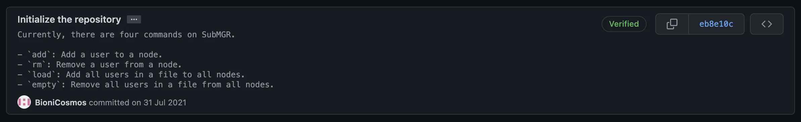
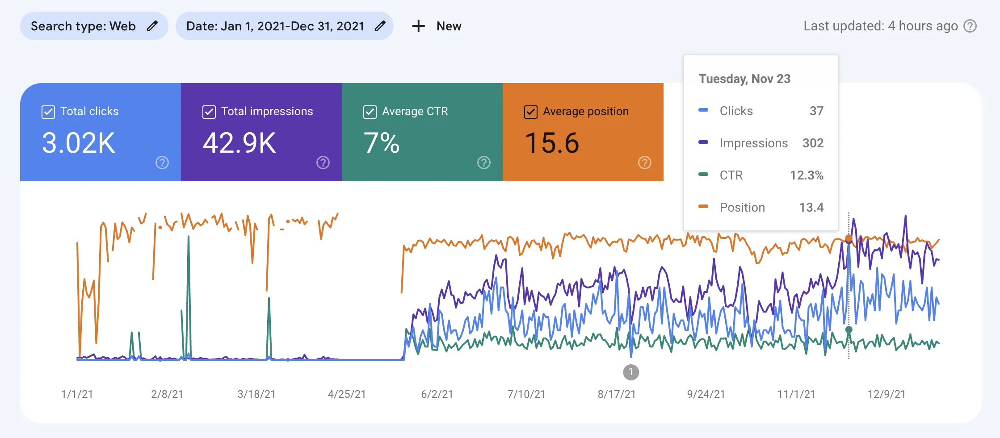
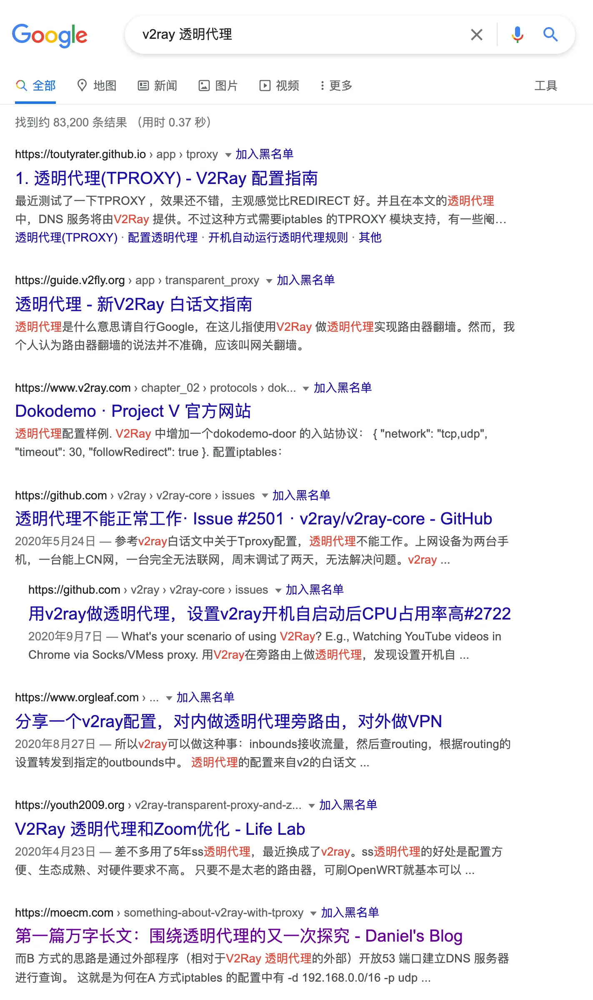

# 发掘过往，筑基未来⸺2021 博客年终总结

时光荏苒，斗转星移，转眼之间，2021 年已悄然流过。在这一年的时间里，有太多事情值得我们去回忆，现在就让我在这篇年终总结中娓娓道来。

<!--more-->

首先从离我们最近的博客着手。非常惭愧的是在 365 天的时光里，我只发布了两篇文章。客观来讲，这一年事情很多，人生也面临着诸多变化，但我想，这些都不足以作为没写博客的理由，终究还是这种习惯没有养成。

但是暗地里，整个博客还是发生了悄无声息（非常明显）的变化。首先是博客系统由动态的 Typecho 换成了静态的 Hexo，是的，我又又又重新开始使用它了，而这一决定是有很多原因的。

在诸多博客系统里面，Hexo 是我最先接触的，但当时也仅仅是接触罢了。后来当我购买了属于我的第一个域名，真正萌发写博客的念头时，我用的还是 Hexo。可惜，对于那时的我来说使用 Hexo 有一定难度，这种难度体现在两个方面，一是静态博客的配置需要写配置文件和敲指令，二是最常用的电子设备是手机而不是电脑，各种操作都略显麻烦。相比之下，作为动态博客的 Typecho 在配置好之后只需要点一点就可以完成大多数操作。

但随着时间的推移，上述两个难点都被克服，Typecho 的各种不足之处也逐渐体现出来。最突出的问题就是落后，就 Typecho 本身而言，该项目社区氛围差，给人一种半死不活的感觉，直到 2021 年 9 月终于发布了一个新的版本，而距离上一次发布已长达四年之久。其次就是技术栈，Typecho 使用「世界上最好的编程语言」PHP 编写，而这门语言是我碰都不想碰的（个人喜好问题，不喜勿喷），但如果想要对博客进行更深入的自定义，就不得不接触 PHP。综上，我决定使用 Hexo。

这个决定绝不是浪费时间，因为它让我对 HTML、CSS、JavaScript 的编写更加娴熟。其中有两件事值得一提：一、在之前的年终总结中提到过，我比较重视来源引用，但经过测试，目前市面上可以开箱即用的脚注渲染都不尽如人意，最终，我决定对 [LouisBarranqueiro/hexo-footnotes](https://github.com/LouisBarranqueiro/hexo-footnotes) 进行修改。这是我第一次真正阅读他人代码，完全读懂，并对其进行修改；二、在对博客进行诸多修改后，网页的整体加载速度慢到令人发指，于是我决定开始优化。而优化的结果就是 Lighthouse 移动设备性能评分达到 97。这里十分感谢 Sukka 大佬的博客，虽然彼此之间互不相识，但他的无私分享让我受益匪浅，不仅是优化博客性能，我的博客主题也基于 Hexo 默认主题并借鉴他的进行修改。如此多彩且美好的网络空间正是像 Sukka 这样的大佬们携手建设起来的。

说完了前端方面的进步，就要说说后端了。目前，我首选的编程语言是 Go，这是我最喜欢的一款编程语言。学习 Go 缘于 V2Ray、Caddy 等很多比较流行的程序都使用 Go 编写。Go 适合编写 Web 程序，不同于 PHP、Java 等老牌 Web 编程语言需要解析器或虚拟机才能运行，Go 通过编译为单文件二进制程序直接运行。Go 关键字少，代码风格简洁，交叉编译简单，标准库功能丰富。基于以上理由，我决定学习 Go。起初，我找到 [Go 官方的交互学习教程](https://tour.go-zh.org)，通过它可以很快地上手 Go。跟着教程走一遍后（除了「并发」部分），我决定自己写点什么。

当时，我发现市面上并没有支持 Xray 且支持统一管理的面板，于是我下定决心用 Go 写一个 Xray 多用户管理的程序。从零开始写一个程序真的很难，写完 `func main() {}` 之后一时「拔剑四顾心茫然」，倒不是说代码本身、程序逻辑或是算法上有多么复杂，做算法题有明确的目标，难点在于如何实现这个目标，而写项目的难点在于需要考虑的东西太多，令人无从下手。

幸好，在一番查找后，终于找到了如何调用 Xray API 增删用户的具体代码，但随之而来的问题是如何使用这些代码。不得已地，我只好硬着头皮尝试。不得不说，实践是最有效的学习方法，在写代码的过程中，常常遇到各种错误以及不会写的地方，这时就需要查找各种资料以补全自己的知识体系。[《Go 入门指南》](https://github.com/unknwon/the-way-to-go_ZH_CN)这本书在学习过程中帮了我很大的忙，我主要把它作为文档来参考。

终于，在 2021 年 7 月 31 日的晚间时刻，我完成了我的第一个项目⸺SubMGR 的第一版。

2021 下半年，通过不断地学习和实践，我对 SubMGR 进行了各种维护。在学习了越来越多的 Web 编程知识后，SubMGR 成功支持订阅链接动态生成服务器的功能。紧接着，我又编写了第二个项目，Code Sharing，一个主要用于分享代码的在线剪贴板。（在他们之间，我其实还与 [@DamoclesYW](https://github.com/DamoclesYW) 合作写过一个非常简单的私人 Web 项目，它也由 Go 编写。）

虽然这些项目的前端页面都使用渲染模版而不是前后端分离实现，但毕竟写的是 Web 程序，前端内容肯定是少不了的。再加上 C 语言的进一步学习以及实验室的参加，我的编程能力得到了综合提升。

除此之外，我非常喜欢 [CS50](https://cs50.harvard.edu) 这门课程，这是由哈佛大学开展的一门计算机科学入门课程。有关 CS50 的更多信息我会抽空专门做一个专题。

实际上，博客本身在某种程度上也给予我许多正反馈：点击量。我本身并没有太注重 SEO，只是开启了 Google Search Console，并在一些地方宣传了我的博客地址。在去年的博客总结中也说过，写博客的目的主要在于「自我提升」[^1]。但 Google 搜索引擎实在是给力，从 2021 年 5 月末开始，博客点击量出现了较大的提升。

在搜索排名上，这一点也体现得淋漓尽致。

看来，付出终究是有回报的。

2021 年对我来说是一个重要的转折点，一切都在改变，有时令人无所适从，但我想「不忘初心，方得始终」。

> 「你有你的抉择，我有我的抉择，家有家的抉择，国有国的抉择，文明有文明的抉择，历史有历史的抉择。亿万个抉择汇聚，世界方显参差多样，宇宙才真正博大浩渺。但无论大小，每一次抉择，都是一次主动求变，都期待一场苦尽甘来。正如每一棵破土的新芽，都带着穿透时光的倔强。」[^2]

世事无常，「岂能尽如人意，但求无愧于心」[^3]。

Discover the past. Construct the future.

眨眼之间，2022 年也已经走过 5.2%[^4]，希望读到这里的你在新的一年中继续奋勇向前，同时也预祝各位春节快乐，虎年大吉！

[^1]: [浮生若梦，万物皆虚⸺第一篇（2020）博客年终总结 | Daniel's Blog](https://moecm.com/the-annual-review-of-2020/)
[^2]: [2022新年献词丨每一次抉择都期待一场苦尽甘来 | 南方周末](https://www.infzm.com/contents/220935)
[^3]: 出自[刘伯温](https://zh.wikipedia.org/wiki/刘伯温)
[^4]: [时钟 - The Clock](https://clock.moecm.com)