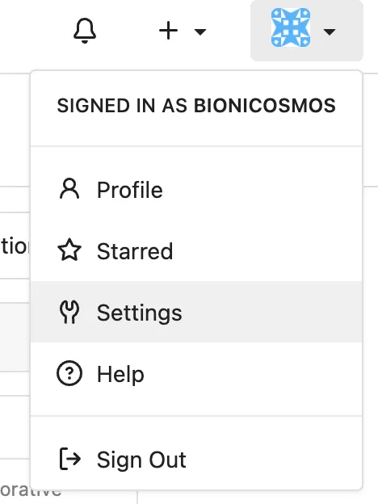
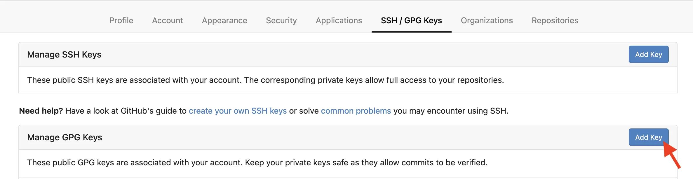
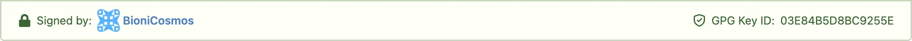

# DN42 入坑记录（注册篇）

DN42 对我来说不是一个新词，之前在一些个人博客中看到过它，但并没有深究。手里有一些空闲的 VPS，上面基本空载，放在那里吃灰好浪费，于是就去问问万能的 Google：

「Hey, Google! What can we do with a VPS?」

「……」

在茫茫结果中，我再一次遇见了「DN42」。

<!--more-->

## 什么是 DN42？

或许你对 Tor、I2P 的大名早有耳闻，其实 DN42 和他们一样，都是暗网，即搜索引擎搜不到的网络，只不过他们各自被创建的目的不同。让我们来看看 DN42 官网给出的定义：

> 「dn42 is a big dynamic VPN, which employs Internet technologies (BGP, whois database, DNS, etc). Participants connect to each other using network tunnels (GRE, OpenVPN, WireGuard, Tinc, IPsec) and exchange routes thanks to the Border Gateway Protocol.」[^1]

Tor 和 I2P 注重匿名性，而 DN42 意不在此，它模拟出一个去中心化的互联网，可供接入者进行计算机网络技术实验而不必担心对真实互联网造成影响。

## 准备工作

在 [DN42 GIT](https://git.dn42.dev) 上注册一个账户，注册完毕等待几分钟后，个人仓库列表中会出现 dn42/registry，此时在终端克隆仓库，并按要求输入用户名和密码。

```shellsession
$ git clone https://git.dn42.dev/dn42/registry.git
```

身份验证需要生成 GPG 密钥。[^2]

```shellsession
$ gpg --full-generate-key
请选择您要使用的密钥类型：
   (1) RSA 和 RSA
   (2) DSA 和 Elgamal
   (3) DSA（仅用于签名）
   (4) RSA（仅用于签名）
   (9) ECC（签名和加密） *默认*
  (10) ECC（仅用于签名）
 （14）卡中现有密钥
您的选择是？
请选择您想要使用的椭圆曲线：
   (1) Curve 25519 *默认*
   (4) NIST P-384
   (6) Brainpool P-256
您的选择是？
请设定这个密钥的有效期限。
         0 = 密钥永不过期
      <n>  = 密钥在 n 天后过期
      <n>w = 密钥在 n 周后过期
      <n>m = 密钥在 n 月后过期
      <n>y = 密钥在 n 年后过期
密钥的有效期限是？(0)
密钥永远不会过期
这些内容正确吗？ (y/N) y

GnuPG 需要构建用户标识以辨认您的密钥。

真实姓名： BioniCosmos
电子邮件地址： admin@moecm.com
注释：
您选定了此用户标识：
    “BioniCosmos <admin@moecm.com>”

更改姓名（N）、注释（C）、电子邮件地址（E）或确定（O）/退出（Q）？ O
```

`真实姓名`（用户名）和`电子邮件地址`使用 DN42 GIT 上的注册信息，其他保持默认。

填写后会要求设定 GPG 密钥的验证密码。

```shellsession
$ gpg --list-secret-keys --keyid-format=long
sec   ed25519/03E84B5D8BC9255E 2022-03-30 [SC]
      209A091A4428B203E77F212803E84B5D8BC9255E
uid                   [ 绝对 ] BioniCosmos <admin@moecm.com>
ssb   cv25519/A45FFAC1025F5497 2022-03-30 [E]
```

我们记第一行中的 `03E84B5D8BC9255E` 为 GPG 密钥 ID，第二行的字符串为 GPG 密钥指纹。

## 填写注册文件[^3]

**注意**：

- 以下所有操作需在克隆下来的 Git 仓库（文件夹）`registry` 内进行。
- 文件中每一项的值都应该从第 20 列开始填写。
- 文件中所有空白分隔处应使用空格填充而非 tab。
- 所有示例文件均是我个人的注册信息，**切勿直接使用**！如需复制示例，请将其中的值根据示例下方的说明和实际情况进行修改。

接下来我们会陆续创建 3 + 5 = 8 个文件，他们分别是：

- 维护者
- 密钥
- 个人
- 资源
  - ASN
  - IPv4 地址块
  - IPv6 地址块
  - IPv4 路由
  - IPv6 路由

### 维护者

创建 `data/mntner/<名称>-MNT`（如 `BIONICOSMOS-MNT`）。

```
mntner:             BIONICOSMOS-MNT
admin-c:            BIONICOSMOS-DN42
tech-c:             BIONICOSMOS-DN42
mnt-by:             BIONICOSMOS-MNT
auth:               PGPKEY-8BC9255E
source:             DN42
```

- `mntner`：`<名称>-MNT`
- `admin-c`：`<名称>-DN42`
- `tech-c`：`<名称>-DN42`
- `mnt-by`：`<名称>-MNT`
- `auth`：`PGPKEY-<GPG 密钥指纹的后 8 位>`[^4]
- `source`：固定值 `DN42`

`admin-c`、`tech-c`、`mnt-by`、`source` 四项在后面的配置中很常用，故不再多加赘述。

### 密钥

创建 `data/key-cert/PGPKEY-<GPG 密钥指纹的后 8 位>`（如 `PGPKEY-8BC9255E`）。

```
key-cert:           PGPKEY-8BC9255E
method:             PGP
fingerpr:           209A 091A 4428 B203 E77F 2128 03E8 4B5D 8BC9 255E
owner:              BioniCosmos <admin@moecm.com>
certif:             -----BEGIN PGP PUBLIC KEY BLOCK-----
certif:
certif:             mDMEYkQR8RYJKwYBBAHaRw8BAQdALLtiw4dKZyLyNYOILW16yq3kGYPkJZEf2bIB
certif:             wQWi7jS0HUJpb25pQ29zbW9zIDxhZG1pbkBtb2VjbS5jb20+iJQEExYKADwWIQQg
certif:             mgkaRCiyA+d/ISgD6Etdi8klXgUCYkQR8QIbAwULCQgHAgMiAgEGFQoJCAsCBBYC
certif:             AwECHgcCF4AACgkQA+hLXYvJJV7h8AEA6L9GFNu98mfC54BTv0tjkEVaaq7JGC9s
certif:             1bUUGdSND4UBAKEBa2hJogq1A3wVgCJ8Czo0IF8vSkm6/ouKHdR13VMIuDgEYkQR
certif:             8RIKKwYBBAGXVQEFAQEHQKFlNZZf+XWSLtzvZf1/olZaIkN2UCGLVpm4q6dKxP0F
certif:             AwEIB4h4BBgWCgAgFiEEIJoJGkQosgPnfyEoA+hLXYvJJV4FAmJEEfECGwwACgkQ
certif:             A+hLXYvJJV5IHAEA2WqiZombY7kIQ3hujT3lxIlJHQTOSNW771H0FsM/Wj4A/0U5
certif:             51dq5JA6v3qUpfYr1s6TNIRiXuVj/v1T2b+im/8D
certif:             =acSy
certif:             -----END PGP PUBLIC KEY BLOCK-----
admin-c:            BIONICOSMOS-DN42
tech-c:             BIONICOSMOS-DN42
mnt-by:             BIONICOSMOS-MNT
source:             DN42
```

- `key-cert`：`PGPKEY-<GPG 密钥指纹的后 8 位>`
- `method`：固定值 `PGP`
- `fingerpr`：GPG 密钥指纹，每 4 位用空格分隔开
- `owner`：`<真实姓名（用户名）> <<电子邮件地址>>`，执行 `gpg --list-secret-keys --keyid-format=long` 可获取
- `certif`：GPG 公钥，执行 `gpg --armor --export <GPG 密钥 ID>` 可获取

你还可以将 GPG 公钥添加到 DN42 GIT 上。首先登录网站。





**注意**：创建密钥验证文件和把密钥添加到 DN42 GIT 是相互独立的两件事，前者必做，否则你的 pull request 不会被合并；后者选做，添加后你的 commit 在网页上会被特殊标记。



### 个人

创建 `data/person/<名称>-DN42`（如 `BIONICOSMOS-DN42`）。

```
person:             Daniel
e-mail:             admin@moecm.com
nic-hdl:            BIONICOSMOS-DN42
mnt-by:             BIONICOSMOS-MNT
source:             DN42
```

- `person`：任意名称
- `e-mail`：电子邮件地址
- `nic-hdl`：`<名称>-DN42`

### 资源

资源注册文件可按需填写。即使 DN42 并不是真实的互联网，其中的资源同样宝贵。

#### ASN

在 [DN42 Free Explorer](https://explorer.burble.com/free#/asn) 上选择一个可用的自治系统编号，然后创建 `data/aut-num/<自治系统编号>`（如 `AS4242423305`）。

```
aut-num:            AS4242423305
as-name:            AS-BIONICOSMOS-DN42
admin-c:            BIONICOSMOS-DN42
tech-c:             BIONICOSMOS-DN42
mnt-by:             BIONICOSMOS-MNT
source:             DN42
```

- `aut-num`：自治系统编号
- `as-name`：`AS-<名称>-DN42`

#### IPv4 地址块

在 [DN42 Free Explorer](https://explorer.burble.com/free#/4) 上选择一块可用的 IPv4 地址，然后创建 `data/inetnum/<IPv4 地址>_<前缀长度>`（如 `172.22.76.8_29`）。

```
inetnum:            172.22.76.8 - 172.22.76.15
cidr:               172.22.76.8/29
netname:            WITCH-NETWORK
admin-c:            BIONICOSMOS-DN42
tech-c:             BIONICOSMOS-DN42
mnt-by:             BIONICOSMOS-MNT
status:             ASSIGNED
source:             DN42
```

- `inetnum`：IPv4 地址范围，可通过[网络和 IP 地址计算器](https://tool.chinaz.com/Tools/subnetmask)获取（**注意**：从「网络」到「广播」都包括在内。）
- `cidr`：IPv4 CIDR 地址块
- `netname`：任意网络名称
- `status`：固定值 `ASSIGNED`

#### IPv6 地址块

在 [DN42 Free Explorer](https://explorer.burble.com/free#/6) 上选择一块可用的 IPv6 地址，然后创建 `data/inet6num/<IPv6 地址>_<前缀长度>`（如 `fddf:6b2:7a5c::_48`）。

```
inet6num:           fddf:06b2:7a5c:0000:0000:0000:0000:0000 - fddf:06b2:7a5c:ffff:ffff:ffff:ffff:ffff
cidr:               fddf:6b2:7a5c::/48
netname:            WITCH-NETWORK
admin-c:            BIONICOSMOS-DN42
tech-c:             BIONICOSMOS-DN42
mnt-by:             BIONICOSMOS-MNT
status:             ASSIGNED
source:             DN42
```

- `inet6num`：IPv6 地址范围，按示例格式填写（**注意**：不足四位用 0 补全，如 `6b2` 补全为 `06b2`。）
- `cidr`：IPv6 CIDR 地址块
- `netname`：任意网络名称
- `status`：固定值 `ASSIGNED`

#### IPv4 路由

创建 `data/route/<IPv4 地址>_<前缀长度>`（如 `172.22.76.8_29`）。

```
route:              172.22.76.8/29
origin:             AS4242423305
mnt-by:             BIONICOSMOS-MNT
source:             DN42
```

- `route`：IPv4 CIDR 地址块
- `origin`：自治系统编号

#### IPv6 路由

创建 `data/route6/<IPv6 地址>_<前缀长度>`（如 `fddf:6b2:7a5c::_48`）。

```
route6:             fddf:6b2:7a5c::/48
origin:             AS4242423305
max-length:         48
mnt-by:             BIONICOSMOS-MNT
source:             DN42
```

- `route6`：IPv6 CIDR 地址块
- `origin`：自治系统编号
- `max-length`：IPv6 地址块的前缀长度

## 提交[^5][^6]

```shellsession
$ git config user.email <电子邮件地址>
$ git config user.name <用户名>
$ git config user.signingkey <GPG 密钥 ID>
$ git config commit.gpgsign true
$ [ -f ~/.bashrc ] && echo 'export GPG_TTY=$(tty)' >> ~/.bashrc && source ~/.bashrc
$ git checkout -b <用户名>-<YYYYMMDD>/<本次更改的概述> # 如 BioniCosmos-20220330/register，日期应为当前 UTC 时间。
$ ./fmt-my-stuff <名称>-MNT
$ ./check-my-stuff <名称>-MNT
$ ./check-pol origin/master <名称>-MNT
```

如出现错误，须按照提示进行修改。

```shellsession
$ git add -A
$ git commit -am "<提交消息>"
$ # 此时会提示输入 GPG 密钥的验证密码。
$ git push -u origin <用户名>-<YYYYMMDD>/<本次更改的概述>
```

最后在 DN42 GIT 上发起 pull request。首先会进行自动审核，如有错误请及时按提示进行修改。

**注意**：多个 commit 应使用 `./squash-my-commits` 脚本或手动 rebase 合并为一个，合并后应使用 `git push -f` 强制推送到远程仓库。

之后耐心等待人工审核，在这期间好好睡上一觉，醒来后 PR 就会被合并啦。（或者被要求修改错误。）

[^1]: [Home - DN42 Wiki](https://dn42.dev/Home)
[^2]: [生成新 GPG 密钥 - GitHub Docs](https://docs.github.com/cn/authentication/managing-commit-signature-verification/generating-a-new-gpg-key)
[^3]: [howto/Getting Started - DN42 Wiki](https://dn42.dev/howto/Getting-Started)
[^4]: [howto/Registry Authentication - DN42 Wiki](https://dn42.dev/howto/Registry-Authentication)
[^5]: [将您的签名密钥告知 Git - GitHub Docs](https://docs.github.com/cn/authentication/managing-commit-signature-verification/telling-git-about-your-signing-key)
[^6]: [registry/README.md at master -  registry - DN42 GIT](https://git.dn42.dev/dn42/registry/src/branch/master/README.md)
