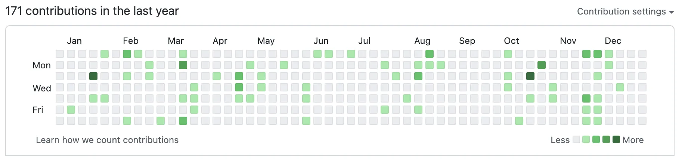

# 虚实难辨，幻梦延续⸺2022 年终总结

之前，我大概提前一个月就开始动笔撰写年终总结，然而直到几周前，我才想起来今年的年终总结还没写，就这么一直拖到 2022 年的最后一天。此时题目未知，正文未知，那么就从去年的年终总结开始，谈谈今年的收获吧。

<!--more-->

## 博客的变化

去年，博客系统从 Typecho 换成了 Hexo，这是博客轻量化的第一步。今年 6 月，我将博客从自己的服务器迁移到 Vercel 上，免于自己维护，不用怕服务器炸掉，访问体验也还行；11 月，重新设计博客 UI，新 UI 与旧 UI 相比更加简洁、直观；同时，我将评论系统 Wind-Comment 的后端服务使用 [Hono](https://honojs.dev/) 重写，并迁移到 Cloudflare Workers 上（数据还没迁移呢，懒～），自此，整个博客完全脱离服务器。

这样做的好处是明显的。今年 7 月，由于当时在某台服务器进行大量的上传和下载操作，导致当月流量耗尽，服务器直接被关闭，幸好吸取了之前的教训，数据做好了备份，但要将各种服务重新部署仍然需要不少时间（于是我又一次吸取教训，将服务，尤其是 PHP，使用 Podman 容器化）；无独有偶，几天前，某台服务器的宿主机出现问题，导致机器离线。虽然我所搭建的这些服务不具有什么商业价值，但我和几个小伙伴在平常生活中的确要用到，如果出现问题的确很麻烦。而使用 Serverless 就无需自己维护了，SLA 也有保证，非常方便。

此外，今年共发布 9 篇文章，这是一个新的记录，明年继续加油！

## 编程语言和项目

从文章中也能看出，目前我认为自己掌握一点的语言有：C、C++、Elixir、Go、JavaScript（TypeScript）、Kotlin、Rust，下面就详细说说对于这些语言的掌握情况。

### C

在上面的语言中，C 是最简单的，也是最难的。虽然我不会用 C 写什么程序，但在了解底层时 C 是最合适的。

### C++

除了算法，我也不会用 C++ 写什么程序，因为有 Rust。不过，《设计模式：可复用面向对象软件的基础》一书中讲解时使用的语言是 C++。近年来 C++ 标准不断推陈出新，这种架势绝无仅有，真让人期待它还有什么新花样。

### Elixir

函数式，Ruby 风格，这两点就让这门语言和其他的有了很大区别，目前我对它的了解仅限于学习笔记的内容，慢慢学，不急。

### Go

Go 显然是我用的最多，最精通的语言。去年，我学习了 Go，编写了 [SubMGR](https://github.com/BioniCosmos/SubMGR) 的初版。而今年，我将 SubMGR 重写，将其从命令行程序变为 Web 程序，这也是我目前维护时间最长，代码最为复杂的项目。在这个过程中，我更加熟悉 Go，同时，我还研究了一点 Xray 的代码，令我受益匪浅。

### JavaScript（TypeScript）

就像 C 和 C++，这两门语言理应分开来说，但我对「Type」这一部分实在没有太多理解。除了 Go，JS 也是我较为精通的一门语言，毕竟 Web 前端没得选，Wasm、Kotlin/JS 只是锦上添花，还是绕不开 JS 本身，何况在后端凭借 Node，JS 同样大展拳脚。框架方面，我用 Vue 写过几个项目，这几天用简单学习了 SolidJS，尝试去写项目，感觉还是用 Vue 吧。

至于 TS，7 月有一个项目，想用 JS 全栈开发，借此机会，就去官网学习了 TS 并写了一个全栈的 [demo](https://github.com/BioniCosmos/user-info)，虽然不会类型体操，但让 JS 类型不那么乱以及 IDE 补全所带来的收益已经足够了。

项目方面，有 Go 的后端，一定就有 TS + Vue 的前端。再就是 [Wind-Comment Serverless](https://github.com/Project-Wind/wind-comment-serverless)，TS 全栈。

### Kotlin

目前 Kotlin 写的最多的一次就是「[Jetpack Compose 简介与 Android 开发初试](/compose-intro/)」中写的 demo，实话说，Kotlin 的语法与 Go 的「大道至简」截然不同，甜得甚至有点齁，经常让人控制不住写一些奇怪的东西。唯一让我无法接受的地方在于 JVM，目前 Kotlin/Native 仍需完善，不提个人喜好问题，JVM 程序在低配服务器上的运行压力较大，对我来说，实用很重要，所以对 Kotlin 没有过深研究。不过在 Android 端，从业界来看 Kotlin 很受欢迎。

### Rust

对于放在最后的 Rust，我可是有铺垫的。首先，Rust 能改写 C++ 没什么问题，但和编译器斗智斗勇真让人又爱又恨。其次，上面提到用 SolidJS 写的项目，其后端其实就是 Rust。项目指 Wind-Image，想用它来取代 Chevereto，在纠结了很久后端语言的选择后，终于决定给自己找不痛快，用 Rust 来编写。

为什么「不痛快」？因为 Rust 无 GC，用以进行应用层开发有不小难度，好在 Rust 抽象能力较高，但这掩盖不了难度高的事实。

对于 Rust 的认识，大概是从 [WebP Server](https://webp.sh) 开始的，这是一个用来实时将图片转换为 WebP 格式的程序。当时，我将这个程序的 Go 版部署在服务器上，用来优化图床上的图片，然而，当加载文章「[Kindle Paperwhite 4 开箱和不完全评测](/kpw4/)」时（当时使用 Typecho + Chevereto，貌似没做懒加载），程序对大量图片的处理所带来的 CPU 和内存占用直接爆掉小鸡，被 OOM 机制杀死，于是我将程序更换为 Rust 版，问题就解决了。虽然不能排除 Go 版优化有一定问题，但 Rust 版的性能显然更高。

从那时起，我就逐渐开始接触 Rust。一开始，我对 Rust 的各种语法感到很奇怪，但随着看教程，做 Rustlings，以及对其他语言的理解加深，我逐渐对 Rust 有了兴趣。

总结一下，学习 Rust 有很大益处，很多领域都能用上它，即使不使用，学习其设计理念和功能特性也是有百利而无一害的。C++ 的特性再多，毕竟年数已高，历史包袱沉重，而 Rust 才能称得上真正的推陈出新。

### What else?

其实除了上面提到的，我对 C#、Java、Python、Ruby 等编程语言也有一些了解，只不过我更喜欢上面的那些语言。那么学这么多语言有用吗？我认为有用。虽然这些语言只是工具，关键还要看「内功」，但上等「武器」会最大化地展现你的实力。「银弹」是不存在的，每种语言有各自的发挥空间。在横向比较的过程中，理解编程范式，发掘内在原理，怎会无用？

此外，之前对 PHP 貌似有很大的偏见，这也是不可取的，人各有喜好很正常，但尽量不要戴有色眼镜。

当然，我在上面所说的「精通」只是相对于自己，学海无涯，就带着这份激情永远走下去吧。

## ACGN

### Anime

#### 《天才王子的赤字国家重生术》

首先，白毛红瞳🥰！

不错的轻改作品，又名《天才制作组的赤字动漫重生术》（

剧情、人物都很不错，事实证明，钱与质量并不能完全挂钩。

#### 《Lycoris Recoil》

要素齐全，但哪个方面都没做好，被高估的作品。如果说《天才王子》是儿戏，那么这部作品儿戏不如。

#### 《契约之吻》

被低估的作品，看起来混乱的人物关系，但实际上每个人物在剧情的刻画下都很丰满，丝毫没有崩坏。正如你以为她是恶魔，其实木更小姐是天使呢。

#### 《继母的拖油瓶是我的前女友》

相比于打打杀杀，我更喜欢平静生活。但要说发糖，我更期待明年仍然由 project No.9 制作的的《关于我在无意间被隔壁的天使变成废柴这件事》，希望别被改炸。

#### 《Angel Beats!》

我看的 Key 社第一部作品，让人泪崩只需要一句话，我信了。

#### 《CLANNAD》

只看了动画版第一季，是神作，但还要再看看。

#### 其他

以下作品看得不全或不是我自己看的。

- 《东京复仇者》：虽然价值观不敢苟同，但总体不错，明年有一部剧场版，期待。
- 《斩·赤红之瞳！》：男主死了？你是 JoJo 吗？不过也合理，难受的是 CP 没磕成。
- 《约定的梦幻岛》：好！但听说第二季一般。
- 《JoJo 的奇妙冒险 石之海》：Part 3 是我自己完整看的，业界独一档的存在，无需过多评价。

### Game

#### 《魔女的夜宴》

嗯？原来你也是柚子厨？在 YUZUSOFT 逐渐废萌化的今天，《魔女的夜宴》是最后一部剧情还不错的作品，绫地宁宁线的分周目剧情让这位坚强的少女的形象在观众眼前活灵活现，令人不禁潸然泪下。

#### 《ATRI -My Dear Moments-》

白毛红瞳……额不对，清流！作为一部在 2020 年的作品，在日益浮躁的今天，《ATRI》正如一股清流，缓缓流进观众们的心里。

此外，作品中对何为智能、何为感情等有关 AI 的话题有所探讨。图灵测试？镜子测试？硅基生命？以前觉得幻想中的 AI 在现实中遥不可及，但 ChatGPT 的出现似乎让我们离梦想更进一步。真实还是虚幻，一定重要吗？

#### 《Study § Steady》

作画不错，动态 CG，清水剧情，能冲就行。

#### 《原神》

开服不久就在玩了，不过当时没有合适的设备。今年八月重新尝试 PlayCover，使用体验和去年相比有了很大改善，终于能流畅游玩了。

#### 《INTO THE BACKROOMS》

主要是看别人玩，但自己逐渐也看会了。很有意思的恐怖游戏，适合几个小伙伴一起玩。

#### 音游

大概从愚人节开始真正入坑，主玩《Phigros》和《Muse Dash》，也玩《A Dance of Fire and Ice》、《Arcaea》、《Cytus》、《Orzmic》、《Rizline》。对于喜欢音乐的人来说，打音游是一种享受，也是纯粹的快乐。

### Novel

#### 《约会大作战》

看完三季动画后迫切的想了解后续，于是找来小说将剩下剧情全部看完。没想到，今年出了第四季动画，对于那些从头追过这个系列的人来说真的是「爷青回」。每一位精灵少女的性格都很鲜明，虽然是后宫，但合情合理，也只有五河士道才能配得上她们吧。

### 总结

我想，《ATRI》是我今年看过的最棒的二次元作品。为什么？我们为什么喜欢二次元？因为她带给我感动，带给我一个幻想的世界，现实中的孤独，需要虚无的填充。玩音游，是想要挑战自己，更重要的是让自己专注于判定线与音符之上，放空自我，享受音乐；玩 Galgame，H 剧情也许是入坑的原因，而精品却是全年龄剧情。神作只需文字，其余皆为点缀。

是的，欢迎来到我的幻想世界，这里只有代码与文字，这就是我的 2022。
