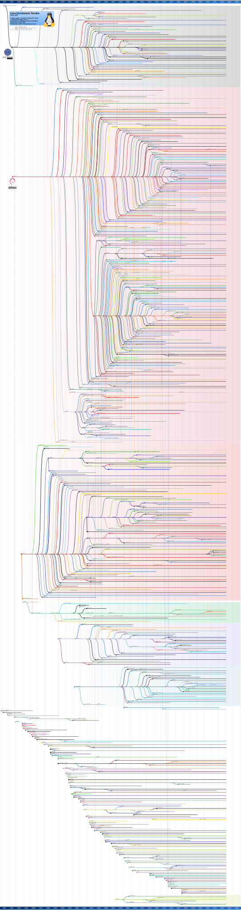
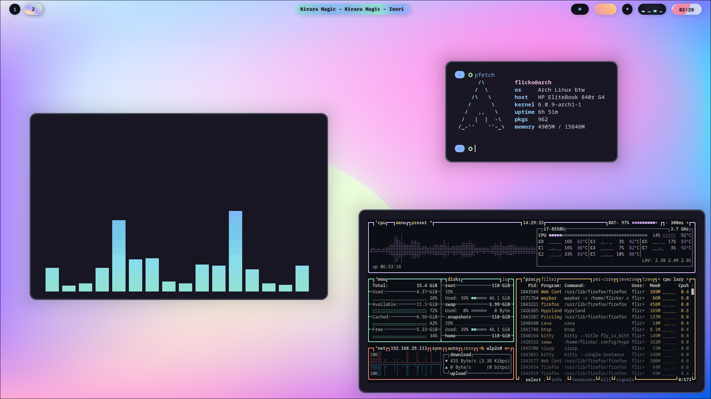
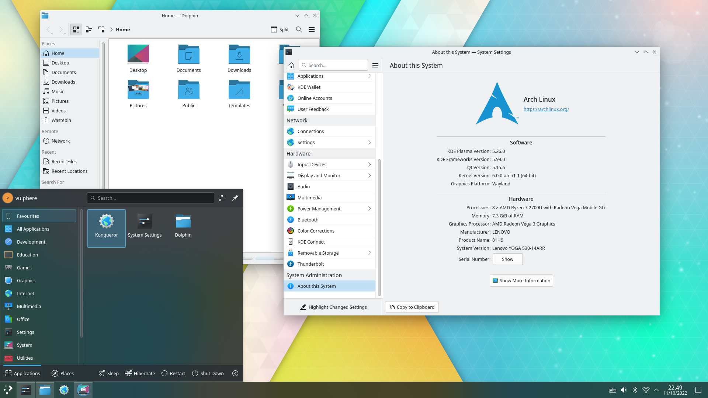
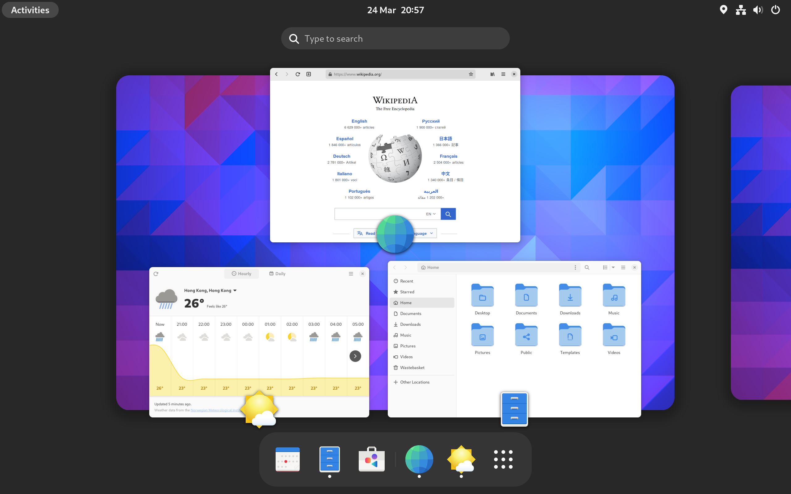
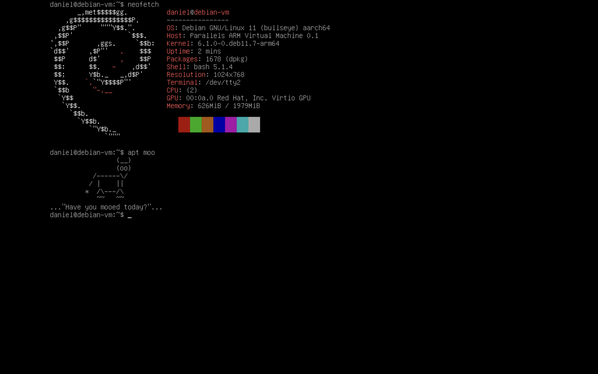
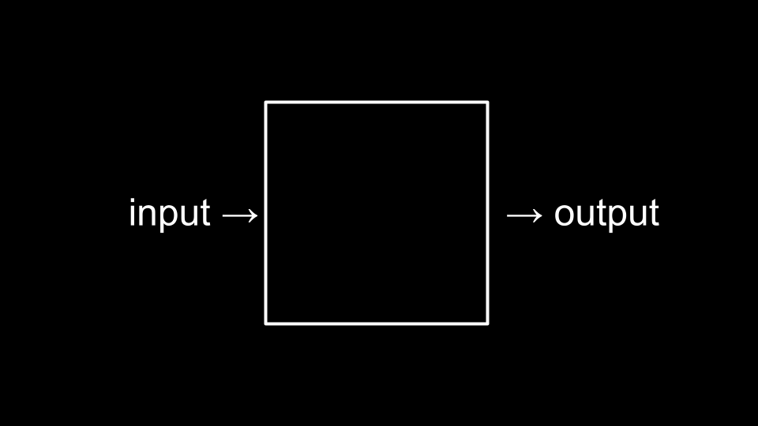
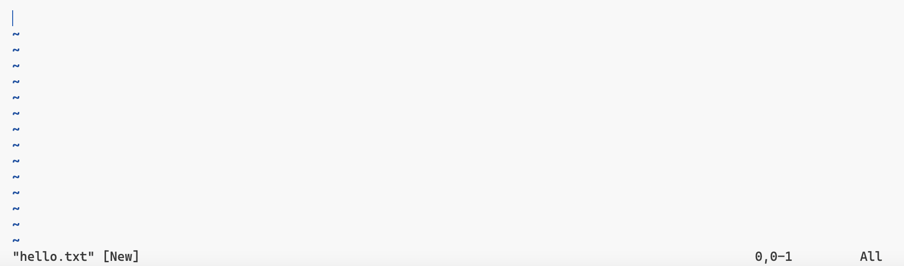
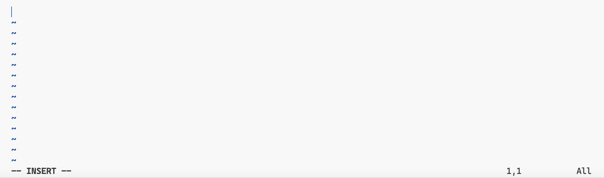
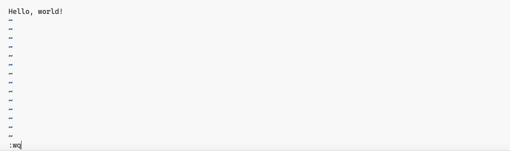

# Linux 零基础初学者的入门指南

世上操作系统无数，而 Linux 似乎既无处不在，又让人颇感神秘。那么接下来，请允许我以这篇文章，引导您慢慢揭开 Linux 的神秘面纱，走进属于 Linux 的世界。

<!--more-->

## 什么是 Linux？（Linux vs. GNU/Linux vs. Linux 发行版 vs. Android）

对于 Linux 这个词语，有狭义和广义两种解释。狭义上来说，Linux 是一种开源的类 UNIX 操作系统宏内核。Linux 内核最早于 1991 年由芬兰黑客 Linus Torvalds 为自己的个人电脑开发的，但如今，各种电子设备上都运行着以 Linux 为内核的操作系统。截至 2017 年 11 月，世界前 500 台最强的超级计算机全部使用 Linux 内核。或许你会觉得这距离我们的实际生活很远，然而事实上，尽管在桌面端使用基于 Linux 内核的操作系统的人数较少，但从智能手机、平板电脑、智能手表、智能电视、智能机顶盒等智能设备上的 Android，到路由器、无线接入点、专用小交换机等嵌入式设备上的 OpenWrt，再到 Steam Deck 游戏掌机上的 SteamOS ，以及服务器上的各种操作系统，他们都基于 Linux 内核。Linux 占领了世界！

从技术上说，Linux 只是一个符合 POSIX 标准的内核，它提供了一套 API，通过接口用户程序能与内核及硬件交互。仅仅一个内核并不是一套完整的操作系统，有一种基于 Linux 内核，使用 GNU 项目中的组件作为系统一部分的完整操作系统被称为 GNU/Linux，而这就是广义上的 Linux，我们平常所说的 Linux 操作系统基本就是指 GNU/Linux 系统。[^1]

到此为止的部分除了某些技术属于外应该不难理解，但接下来的这个概念⸺「Linux 发行版」，对于仅使用过 Windows 的人来说可能就不那么容易理解了。对于 Windows 这种闭源商业系统，Windows 就是 Windows，虽然有诸多版本，但 Windows 系统只有一个。但 GNU/Linux 本身其实并不算一个系统，而是一种系统的标准，或者说是一类系统的集合，而这些系统就被称作 Linux 发行版，如 Arch Linux、Manjaro、Debian、Ubuntu、Red Hat Enterprise Linux（RHEL）、Fedora、openSUSE 等，他们虽然都基于 Linux 内核，使用 GNU 组件，但其包管理器、系统使用方式、图形界面样式、版本更新方案、系统安装方式、系统默认配置等皆有一定不同。

Android 呢？它是否属于 Linux 发行版？Android 是一个基于 Linux 内核的开源移动操作系统，主要用于智能手机和平板电脑等移动设备。虽然 Android 使用了 Linux 内核，但它与传统的 Linux 发行版有很大的区别。Android 在 Linux 内核的基础上构建了自己的运行时环境、应用程序框架和用户界面。因此，虽然 Android 具有一些与 Linux 共享的特性，但它是一个独立的操作系统。那么 Android 是否属于 Linux 发行版？这要看你对「Linux 发行版」这个词的定义，如果指 GNU 系统，那么 Android 大概不算；如果指具有 Linux 内核的系统，Android 显然是。



## 如何选择合适的 GNU/Linux 发行版？

现在你应该知道，所谓官方 GNU/Linux 系统并不存在，那么哪一个发行版更好呢？事实上，每一个发行版都有不同的面向人群，选择自己喜欢的即可。对于初学者来说，Ubuntu 也许是不错的选择；而对于极客和熟悉 Linux 的人来说，可能会选择 Arch Linux 或 Gentoo Linux；对于企业用户来说，他们可能会选择 RHEL；而渗透测试工程师及网络安全研究人员可能更青睐 Kali Linux。

## Free 的 Linux

这个标题其实是一个双关语，因为在英语中，「Free」有「免费」和「自由」两个含义，不过在这里，我并不想过多阐述免费、开源、自由等概念之间的异同点和开源协议、意识形态等问题。简而言之，和 Windows 不同，GNU/Linux 完全免费（你可能觉得并没有为 Windows 付费，那是因为购买电脑时就附带了 Windows 的授权费或使用破解方式激活 Windows），且源代码开放（但这并不意味着发行版中不能/没有安装闭源/私有软件，比如 NVIDIA 显卡驱动），这意味着你不但可以随意使用 GNU/Linux，还可以在拥有一定技术储备后，随意修改系统的各个组件乃至内核，甚至衍生出属于你自己的操作系统。


关于「自由」，这里主要想要表达选择自由。在 Windows 中，你或许已经习惯于系统为你提供好的一切设定，并认为这是理所当然的，但在 GNU/Linux 中，一切都是可以自由选择的。这一点在上面讲述发行版的时候已经提到过了，这里我们举一个具体例子：图形界面。在 Windows 中，你最多能更改主题或安装美化软件，而这往往会给系统运行造成一些额外负担甚至产生 bug。而在 GNU/Linux 中，一切都是可以随意增加、删除、替换、共存的，显示管理器（登录界面，用于切换不同桌面环境和用户）、窗口管理器（管理窗口的排布方式，如我们日常使用的堆叠式和也许更酷的平铺式）、任务栏、文件管理器、终端模拟器……你可以尽情地修改他们，甚至完全删除！是的，GNU/Linux 不需要图形界面也可以正常运行和操作。这些操作在 Windows 下是想都不敢想的。










这里说一些题外话。其实这种多元化的、社区驱动的发展方式有利有弊，好处是选择多多，不受限于商业公司的独断；坏处则是选择太多，项目质量参差不齐。时至今日，GNU/Linux 作为服务器操作系统的地位早已无人撼动，但作为普通消费者的日常操作系统来说，的确还差点意思，尤其在国内，很多问题变得尤为突出。

<script async src="https://telegram.org/js/telegram-widget.js?22" data-telegram-post="MoeCosmos/74" data-width="100%"></script>

> Live CD 环境一般安装在便携式存储设备上，用于安装、修复和体验操作系统。这个例子说明了运维规范的重要性，但也体现出 Linux 的稳定性。

还有一句不得不说的话：不同的选择是让你使用的，不是用来争吵的。这句话适用于各种话题，如操作系统、编程语言、手机厂商……。尽管在这篇文章中我将 Windows 和 GNU/Linux 进行了一些对比，但这并不代表我在踩一捧一，这只不过是想突出 GNU/Linux 的一些特点罢了。三大桌面端操作系统（Windows、GNU/Linux、macOS）和两大移动端操作系统（Android、iOS）我都使用过，每一个都有不同的优缺点，选择自己喜欢的即可，**银弹终究是不存在的**。

## 增删改查的基本操作

下面让我们进入正题，正式开始了解 Linux 的基本使用方法。

首先要阐明的一点是，Linux 只是操作系统的另一种选择（alternative），并不是多么高大上的东西，它与其他操作系统固然有一定区别，但也有共同点。不过，既然这篇文章的主题是 Linux，那么就让我们来看看 Linux 的特色之一：命令行界面（以下简称为 CLI）。

之所以称为特色，不是因为只有 Linux 有 CLI，而是 Linux 的 CLI 更加成熟与流行⸺当然，这也符合人们对 Linux 的刻板印象。我认为，这种刻板印象的产生源自于 Linux 系统在服务器领域的流行，为了更好的稳定性和减少不必要的资源占用，通常服务器上的 Linux 系统不会安装用户图形界面（以下简称为 GUI），而是直接在 CLI 下通过输入指令来使用系统。

想要使用 CLI，我们需要打开系统里的「终端」应用，或者直接使用纯命令行界面（TTY），这时，你会看到类似这样的文字（根据系统配置不同，样式随之不同）：

```shell-session
daniel@vm:~$ 
```

不熟悉 CLI 的人初次见到这个黑底白字的界面时（也有可能是别的颜色哦）可能会感到古老而神秘，所以我们先简单介绍一下这些神秘字符的含义。

```
<用户名>@<主机名>:<当前目录路径><提示符>
```

- 用户名：取决于当前登录的用户。
- 主机名：通常在安装系统时决定。
- 当前目录路径：准确来说是当前工作目录的路径，和地址栏作用类似。
- 提示符：提示你当前处于 shell 环境下，可以输入指令以执行操作。通常来说普通用户的提示符是 `$`，特权用户的提示符是 `#`。

> **什么是 shell？**[^3]
>
> shell 在英语中本意为「壳」（蛋壳、贝壳、果壳等），在计算机科学的语境下，shell 一词可以理解为操作系统的「外壳」，即用户与系统沟通的一层界面。例如：Windows 下的资源管理器、开始菜单、任务栏等桌面环境提供的各种组件都是整个 GUI shell 的一部分；而在 CLI 下，你现在看到的这个黑底白字界面的背后所运行的程序就是一种 shell，当然，Windows 下的 cmd 和 PowerShell 也是 shell，也就是说，GUI 和 CLI 这两种 shell 的不同表现形式可以共存。

多说无益，让我们来实操一下。比如，我们可以使用 `whoami` 指令获取当前登录用户的名称，想要执行这个指令，你需要通过键盘输入这条指令，然后按下回车键，成功执行后界面显示如下。

```shell-session
daniel@vm:~$ whoami
daniel
daniel@vm:~$ 
```

我们来分析一下这个过程。首先，用户输入一段指令，当输入完毕并按下回车后，shell 将开始解析指令、运行指令，此时，若这条指令并非一个 shell 的内置指令或函数，终端的控制权将交给这条指令对应的程序，然后程序将开始运行，并可能将结果输出到终端中（如 `whoami` 就是一个外置程序，其作用是输出用户名），最终程序运行结束，终端的控制权重新回到 shell 手中，这标志着一次指令执行周期的结束，此时 shell 回到最初状态，重新等待下一次指令的输入和执行。

整个过程说起来复杂，总结起来不过是输入、执行、输出三步走，实际上，这就是计算机程序解决问题的最基本模型。



实际上，虽然从技术上讲 GUI 更为先进，但两者各有优缺点。CLI 占用低，稳定，熟悉操作后效率更高，尤其适合批处理任务，可以编写脚本；GUI 更易上手，操作逻辑直观。实际上，如果配置好 shell（如安装 Zsh + Oh My Zsh 或 fish）并配以好用的终端模拟器，你一定能感受到 CLI 的魅力。此外，除了交互使用，还可以编写脚本在 shell 中运行。比如，我们可以使用 Bash 输出斐波那契数列。

```bash
#!/bin/bash

# 定义递归函数来计算斐波那契数列
fibonacci() {
  local n=$1
  if ((n < 2)); then
    echo $n
  else
    echo $(($(fibonacci $((n - 1))) + $(fibonacci $((n - 2)))))
  fi
}

# 读取用户输入的斐波那契数列长度
read -p "请输入斐波那契数列的长度：" n

# 输出斐波那契数列
echo -n "斐波那契数列："
for i in $(seq 0 $((n - 1))); do
  echo -n "$(fibonacci $i) "
done
echo
```

将以上内容放入 `fib.sh` 文件中，然后运行指令，输入长度，查看结果。

```shell-session
$ bash fib.sh
请输入斐波那契数列的长度：10
斐波那契数列：0 1 1 2 3 5 8 13 21 34
```

怎么样，是不是很厉害？当然，你也可能会认为这没什么用，因为这种程序用其他语言写出来更简便，运行速度更快。诚然，shell 脚本在很多方面都不如一般编程语言，但它能够很便捷地调用系统中的指令⸺或者说程序。通过这个例子我们可以看到，shell 支持分支、循环、输入、输出、函数、递归、逻辑表达式、数学计算等常见的编程语言特性，而他们能帮助我们更有效率地使用 CLI。

> 由于行文需要，你可能发现这里的提示符 `$` 和之前的 `daniel@vm:~$` 略有不同，但这不影响我们正常学习和使用 shell。

接下来我们简单了解一下 Linux 中的常用指令。

> 接下来会首先使用图文对 CLI 下的操作进行介绍，之后会通过动画让读者更直观地了解具体操作方法。

| 操作描述                   | 指令格式                                                    |
| -------------------------- | ----------------------------------------------------------- |
| 列出指定目录中的文件和目录 | `ls`                                                        |
| 目录切换                   | `cd <目录名称>`<br>`cd ..`（返回上一级目录）                |
| 查看纯文本文件             | `cat <文件名称>`                                            |
| 复制文件和目录             | `cp <文件名称> <目标目录>`<br>`cp -r <目录名称> <目标目录>` |
| 移动或重命名文件和目录     | `mv <文件/目录名称> <目标目录/新名称>`                      |
| 创建空文件                 | `touch <文件名称>`                                          |
| 创建目录                   | `mkdir <目录名称>`                                          |
| 删除文件                   | `rm <文件名称>`                                             |
| 删除空目录                 | `rmdir <目录名称>`                                          |

> **关于文件删除操作的更多细节**
>
> 1. 默认情况下，所有删除操作都不存在回收站机制，即**永久**删除，所以请在按下回车前确认指令是否正确。
> 2. 实际上，存在直接删除非空目录的指令，即 `rm -r <目录名称>`。
> 3. 如何快速删库跑路？`sudo rm -rf /*`。这条指令会删除一切（是的，自由的 Linux 狠起来连自己都删），导致系统损坏、文件丢失，所以千万**不要**运行！😭

## 常用工具

### 文本编辑器

上面的表格中只列出了简单预览纯文本文件的指令，想要编辑文件就需要文本编辑器。CLI 环境下有很多文本编辑器可供选择，但其中最著名的当属 Emacs 和 Vim，这两个编辑器以其强大的功能和陡峭的学习曲线著称。下面我们简单讲解 Vim 的基本使用方法。

首先在 shell 中输入指令以使用 Vim 打开/创建文件。

```shell-session
$ vim <文件名称>
```



对于一般编辑器而言，打开文件后就可以直接对文件进行任意编辑操作，但 Vim 不是，因为 Vim 是一个多模式编辑器，初始状态下，Vim 处于一般模式，此时我们并不能正常编辑文字，所以我们需要输入 `i`（区分大小写）以进入 Vim 的插入模式。



可以看到，这时界面的左下角会显示 `INSERT`，这说明此时 Vim 处于插入模式下，我们可以进行任意编辑操作。

那么在工作完成后，如何才能保存文件并退出 Vim 呢？

1. 按 <kbd>Esc</kbd> 回到一般模式。
2. 输入 `:wq`。

若操作无误，此时界面应处于下图状态。



最后只需按下回车键，Vim 将保存文件到当前目录下并退出，shell 重新掌管终端。让我们检查一下以上操作是否成功执行。

```shell-session
$ cat <文件名称>
Hello, world!
```

> 为什么这些示例中有的行首有 `$`，有的没有？
>
> 正如上文所提到的，`$` 是提示符，当行首出现提示符时表示 shell 已准备就绪，等待用户输入下一条指令；而行首无提示符说明这行文字是指令执行后的输出，而不是用户的输入。

实际上，以上的操作连 Vim 的冰山一角都算不上，比如，我们并没有介绍一般模式的作用，也只用到了命令模式的 `wq` 而已，如果有兴趣了解更多关于 Vim 的操作，可以参考 Vim 自带的互动教程（在 shell 中输入 `vimtutor zh` 即可进入）。

### 下载器

想要在 CLI 环境中下载文件，可以使用 Wget，使用方法很简单。

```shell-session
$ wget <文件网址>
```

### 编译器

虽然编译器与 Linux 并没有必然的联系，但学习如何在 CLI 环境中手动使用编译器编译程序有益无害，下面我们简单了解一下如何使用 Clang 编译 C 语言源代码并运行编译后的程序。

假设在当前目录下存在 `hello.c` 文件，其中内容为：

```c
#include <stdio.h>

int main(void) {
  printf("Hello, world!\n");
  return 0;
}
```

接着在 shell 中输入指令：

```shell-session
$ clang hello.c -o hello
```

等待片刻后，好像什么都没发生，但你应该感到庆幸，因为这说明你的代码被成功编译了，此时当前目录会出现一个名为 `hello` 的文件，而这就是编译好的程序。

接下来，

```shell-session
$ ./hello
Hello, world!
```

首先解释编译指令。

1. **`clang`**：编译器程序名。
2. **`hello.c`**：源代码文件名。在这个例子中，假设你有一个 C 语言程序的源代码文件，它被命名为 `hello.c`。
3. **`-o hello`**：指定输出文件名。这里，`-o` 是一个选项，它允许你指定输出文件的名称。后面的 `hello` 是输出文件的名称。因此，编译器将生成一个名为 `hello` 的可执行文件。当然，如果不指定这个可选选项，Clang 编译器就会为输出的可执行文件使用默认名称，即 `a.out`。

再来看看运行指令。

毫无疑问，`hello` 是要执行的文件的名称，那么 `./` 呢？为什么不能像运行其他指令一样直接输入 `hello` 呢？想要解释这个问题，我们需要了解 shell 查找指令的机制。当用户在 shell 中输入一条指令后，shell 首先会检查这是否是一条内置指令，如果不是，shell 会遍历 `PATH` 环境变量，检查这条指令是否存在于 `PATH` 中的某个目录下。你可以将 `PATH` 理解为一些路径的集合，而所谓「指令」其实就是一些可执行文件，只不过他们被提前编译好，并存放于系统内部的各个目录下，而 shell 所要做的工作就是一个一个地检查 `PATH` 这个路径集合所指向的各个目录下是否存在与指令同名的可执行文件，有则执行，无则报错。

显然，`hello` 是我们刚刚自己编译好的程序，并不存在于这些目录下，所以 shell 会输出错误 `command not found`。既然如此，怎么做才能运行它呢？方法就是显式指定文件所在的路径。假设 `hello` 位于 `/home/daniel` 下，那么我们可以输入其绝对路径来运行程序。

```shell-session
$ /home/daniel/hello
Hello, world!
```

这样做虽然可行，但输入绝对路径很麻烦，那么我们可以通过相对路径来实现同样的效果，问题在于，如果想要运行的程序正好处于当前目录下，文件名字本身就是其相对路径，但这又会让 shell 执行上文所说的指令查找机制，而解决这个问题的方法就是 `./`，现在让我们回到最开始的问题：`./` 是什么？

上文提到，想要回到上一级目录可以输入 `cd ..`，但并没有解释 `..` 是什么。其实，`..` 代表上一级目录，而 `.` 代表当前目录，`/` 是路径分隔符，所以 `./hello` 就代表当前目录下的 `hello` 文件。

> 为什么直接 `/hello` 不行？
>
> 因为 `/hello` 代表根目录下的 `hello` 文件！ばか〜

## 包管理器

前面简单介绍了一些常用软件的使用方法，但实际执行时可能会发现 shell 提示 `command not found`，这是因为系统并不一定附带这些软件，这时就需要我们手动安装他们，而系统自带的包管理器往往是安装软件的首选方案。虽然包管理器并不是 Linux 独有的功能，但它毫无疑问是 Linux 的特色之一，也是系统的重要组成部分。每一系发行版都带有不同的包管理器，如 Debian 系的 APT/dpkg、Red Hat 系的 DNF（YUM）/RPM、Arch 系的 Pacman 等，可谓是百花齐放，所以，对不同包管理器的喜好程度也成为人们选择不同发行版的评判标准之一。

那么什么是包管理器？顾名思义，包管理器就是用来管理软件包的一种工具，能用于安装、更新、卸载软件包以及自动处理软件包之间的依赖关系。我们可以将包管理器简单类比为软件商店，但它又比普通的软件商店复杂一些。接下来将以 Debian 系包管理器 APT 为例简要说明包管理器的基本概念及使用方法。[^5]

| 操作 | 指令               |
| ---- | ------------------ |
| 更新 | apt update         |
| 安装 | apt install <包名> |
| 升级 | apt upgrade        |
| 卸载 | apt remove <包名>  |

> `update` 与 `upgrade` 有何区别？
>
> 在 APT 中，`update` 用于更新本地软件包列表（刷新操作），这个命令并不会安装新的软件包或升级已安装的软件包；而 `upgrade` 用于实际升级系统中已安装的软件包，将它们更新到最新可用的版本。综上，建议在进行安装或升级操作前先运行 `update` 指令，以免软件包版本落后或无法下载软件包。
>
> 这里有一篇关于英语中两单词区别的文章，可以参考一下：[《单词 update 和 upgrade 的区别》](https://fanyi-app.baidu.com/static/passage/2018-02/2018-02-23/001/index.html)。

例如，之前我们用到了 Clang，假设系统中并没有预装，我们如何使用 APT 安装它呢？

```shell-session
# apt update        # 无需每次都执行，定期执行即可
# apt install clang # 运行后会输出本次操作的相关信息，并提示输入 y 继续，n 中止，输入 y 并按下回车即可
```

你可能会发现，这里的指令中有一些 `#`，这代表什么？首先是每行开头的 `#`，他们和 `$` 一样，都是提示符，只不过 `$` 代表处于普通用户下，`#` 代表处于特权用户下，在 Linux 中，特权用户即 root 用户，它是系统自带的用户，拥有最大的权限。由于对系统软件的相关操作需要修改系统文件，所以需要在特权用户下才能正常使用 APT。

```shell-session
daniel@vm:~$ su - # 切换到 root 用户，需要输入 root 用户的密码
Password: 
root@vm:~# whoami # 查看当前登录用户的名称
root
```

> 为什么我输入密码时没有反应？
>
> 和 GUI 下用 `*` 代替实际字符的习惯不同，CLI 下更喜欢采用无回显的方式，所以盲输密码并在完成后按下回车即可。

而行中的 `#` 以及之后的文字是 shell 中的注释，注释并不会被执行，只起到说明的作用。Bash 只支持单行注释，它会忽略一行之内所有在 `#` 之后的字符。

日常使用 root 用户登录系统并不安全，但每次需要特权时进行用户切换又略显麻烦，于是我们可以使用 Sudo 对普通用户进行提权。

```shell-session
daniel@vm:~$ whoami
daniel
daniel@vm:~$ sudo whoami # 区别于 su，需要输入当前登录用户的密码
[sudo] password for daniel: 
root
```

也就是说，以下两行命令作用相同。

```shell-session
# apt update
$ sudo apt update
```

### 镜像源

在实际下载过程中，你可能会发现软件包的下载速度很慢，如果想要以正常网速下载，我们通常需要手动配置镜像源。「源」指软件包的下载源，「镜像」指下载源的镜像，镜像源服务器会定期向上游服务器同步数据，其作用主要为分散用户的下载请求，减轻上游服务器的负载以及让各地用户就近选择镜像服务器，加快下载速度。除了私有镜像源，公开镜像源一般由某些高校和网络相关公司搭建并维护。

我们仍以 Debian 的 APT 为例，当执行相关指令时，APT 会读取 `/etc/apt/sources.list` 文件，这个文件包含了系统软件源的配置信息。在 Debian 下，我们可以通过以下指令替换镜像源。

```shell-session
# sed -i 's/deb.debian.org/mirrors.bfsu.edu.cn/g' /etc/apt/sources.list
```

sed 是一个流编辑器（**s**tream **ed**itor），其主要用法之一就是用来替换文本。[^6]在这条指令中，我们把默认的镜像源地址 `deb.debian.org` 替换为[北京外国语大学开源软件镜像站](https://mirrors.bfsu.edu.cn/)的地址 `mirrors.bfsu.edu.cn`。

替换后，我们需要运行 `apt update` 以使配置生效。

## 演示动画

以下动画演示了上文中大部分指令的实际使用。

> 你可以任意复制该动画中的字符。

<script async id="asciicast-UFk1a0iAQRVVpHOZZKPVlp65W" src="https://asciinema.org/a/UFk1a0iAQRVVpHOZZKPVlp65W.js"></script>

## 最后一件事……

你是否注意到了动画中的某个细节：很多指令中的字符并不是一个一个键入的，而是一下子出现的，这是自动补全的功劳。对于输入的大部分指令及其参数，你可以按下 <kbd>Tab</kbd> 触发自动补全，实现快速输入，提高使用效率，快来试一试吧。

## 尾声

感谢您细心阅读到这里，如果本文能激起诸位读者对 Linux 的一点点兴趣，或能让您对相关概念有了更多的了解，这便物有所值了。

[^1]: [Linux内核 - 维基百科，自由的百科全书](https://zh.wikipedia.org/zh-cn/Linux内核)
[^2]: [GioComitini](https://commons.wikimedia.org/wiki/File:2023_Linux_Distributions_Timeline.svg), [CC BY-SA 4.0](https://creativecommons.org/licenses/by-sa/4.0), via Wikimedia Commons
[^3]: [Shell (computing) - Wikipedia](https://en.wikipedia.org/wiki/Shell_(computing))
[^4]: [Computational Thinking | Lecture 0 - CS50x 2023](https://cs50.harvard.edu/x/2023/notes/0/#computational-thinking)
[^5]: [Package manager - Wikipedia](https://en.wikipedia.org/wiki/Package_manager)
[^6]: [sed - 维基百科，自由的百科全书](https://zh.wikipedia.org/zh-cn/Sed)
