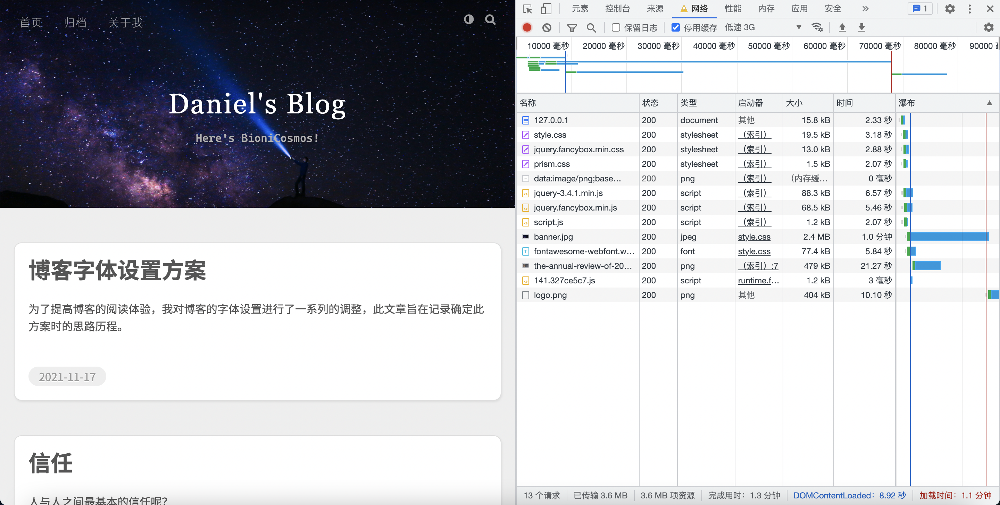
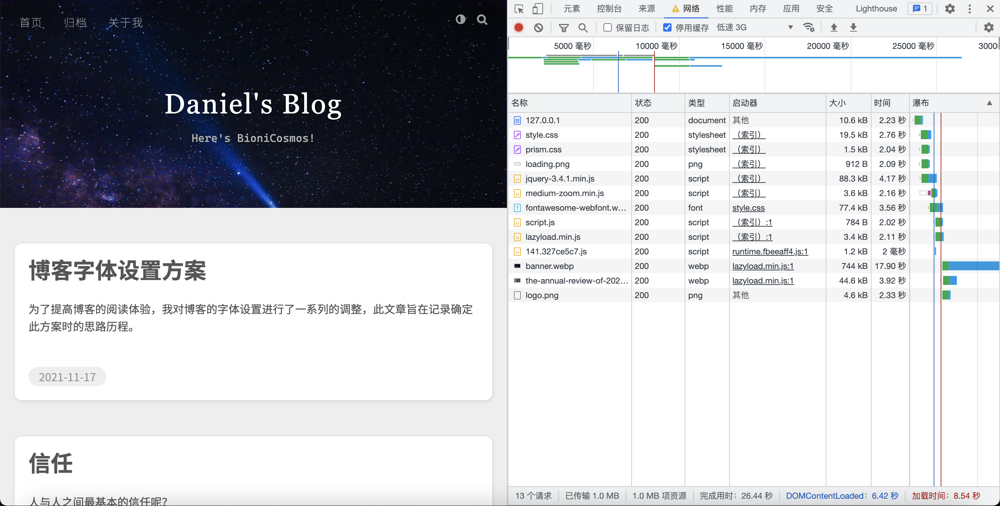
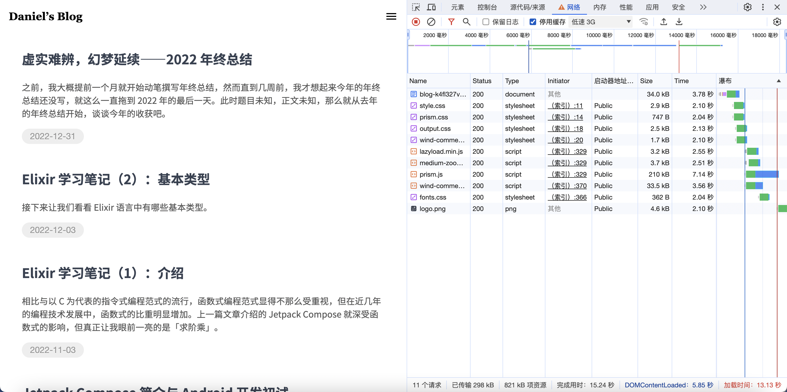
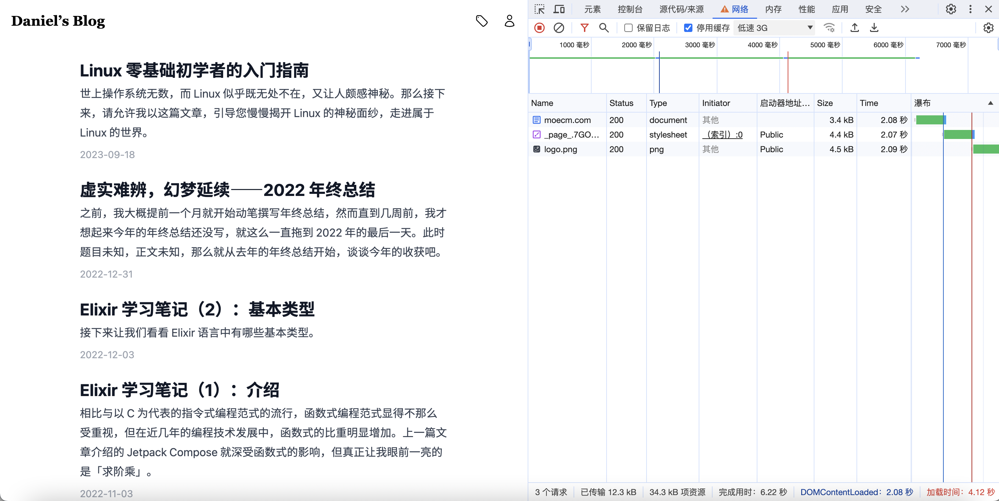
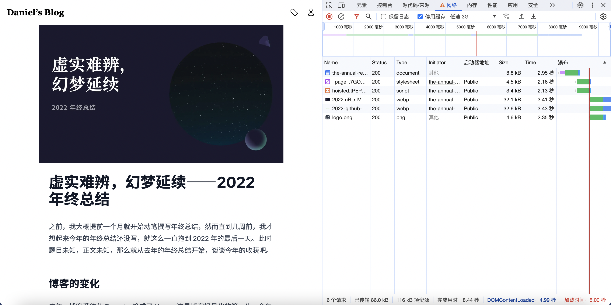
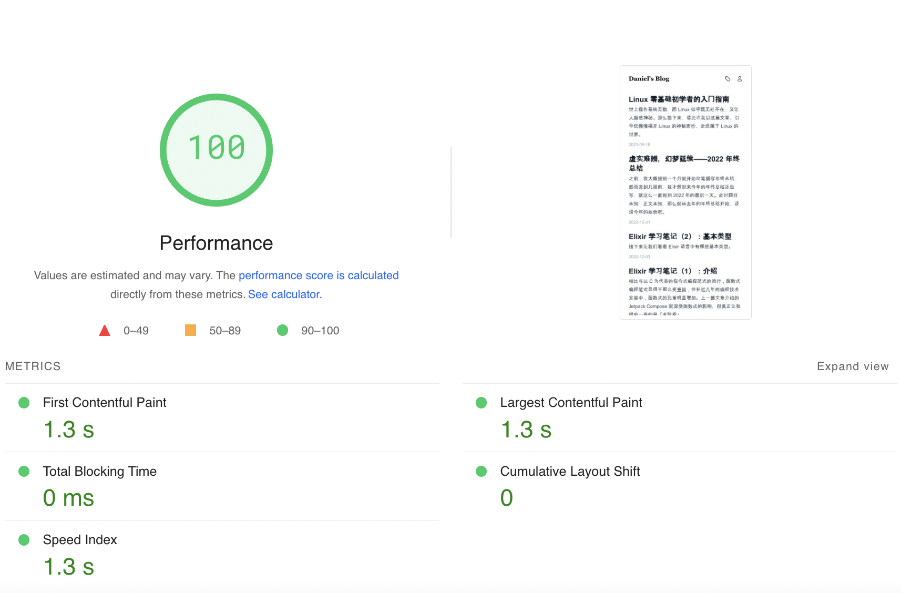

# 路在何方？路在脚下⸺2023 年终总结

原本，这篇文章的题目是《博客改造之路 4》，可当我落笔时，回忆起 2023，或许，我们还是来写一篇姗姗来迟的年终总结吧。

<!--more-->

在 2023 年 9 月时，我曾在 Telegram 频道中发过一则消息。

<script async src="https://telegram.org/js/telegram-widget.js?22" data-telegram-post="MoeCosmos/73" data-width="100%"></script>

那么现在，就我来解释一下，为什么 2023 几乎可以说没有一篇文章，换言之，2023，发生了什么？

## 博客改造之路 4

如果你想问前几篇于何处，请参阅之前的年终总结。

在折腾博客这条路子上，我们从未停步，正经文章倒是没写几篇。起初可能只是觉得折腾新技术好玩，到了后来就开始重视访问体验了。比如，曾经，在低速 3G 环境下模拟，博客主页加载时间能长达一分多钟，有图有真相。



于是便进行各种优化：使用 WebP 格式的图片、懒加载、异步/延迟加载 JS、压缩代码、优化资源加载时序……[^1]总之，在一系列操作后，加载速度得到了巨幅提升。



之后，我们重新设计了博客，从外表来看更加简洁，实际上，移除了一些，又增加了一些，整个博客其实早已满是补丁，变得十分臃肿。



于是，从头再来似乎成了最佳选择。实际上，想要从头设计一款博客框架是一个很早就有的想法，比如基于 VuePress 或完全从零开始编写，但本着能用就行的原则，又受限于当时的技术力，这些想法也不过只是想法，顶多就是新建文件夹罢了。但在看到[其他博主的转移](https://stblog.penclub.club/posts/removeHexo/)，以及了解到 [Hexo 开发者也选择重构](https://blog.skk.moe/post/use-nextjs-and-hexo-to-rebuild-my-blog/)之后，我意识到，或许现在是时候放弃 Hexo 了。

对于初学者来说，Hexo 能够开箱即用，社区资源丰富，这是它的优点。可当我们想要深入改造时却发现 Hexo 设计之复杂，技术之古老。是的，如果从 [Hexo 仓库的第一次 commit 记录](https://github.com/hexojs/hexo/commit/6129b2fd773ffafa0bf5626df26b72e7e8f7ad7c)算起，它已经 12 岁了，对于一天一个样子的前端生态圈来说，Hexo 确实可以被称为上古作品了。所以，在经过一系列筛选后，我决定使用 Astro 构建我的博客。

Astro 是典型的面向内容的现代 SSG Web 框架（也支持 SSR），支持流行的 JSX 语法和 islands 架构。很好，这就是我想要的模样，我便花了些时间，开始阅读 Astro 官网的教程与文档。7 月，我正式开始将 Hexo 逐步迁移到 Astro。

### 模板，EJS → JSX

反人类 to 优雅，没什么好说的，感觉这些奇奇怪怪的模板引擎都挺丑陋的。

### CSS 框架，Stylus → Tailwind CSS

就如同我只会 Vue 3（组合式 API）而不会 Vue 2（选项式 API），看到 Tailwind CSS 的第一眼就被吸引住了，并没有学习过 Stylus/SCSS/Less。一个字评价 Tailwind CSS 编码体验：爽！

### 语法处理，markdown-it → unified

这两个也许并不能相提并论。markdown-it 是一个不错的 Markdown 语法解析器，对于一般场景来说也足够应付；而 unified 是一整个工具集，有着完整的生态，支持多种文件格式，功能十分丰富，可扩展性强。由于我对 Markdown 解析有特殊需求，之前，需要对整个文本进行预处理，通过各种条件语句和手搓正则表达式来达成目标；而现在，在 unified 工具生成的语法树和提供的实用函数的帮助下，我能轻松地完成这些任务，真是相见恨晚啊。

### 语法高亮，Prism → Shiki

服务端渲染、现代化、社区活跃，有什么理由不选它？

### 图像处理，手动 → 自动

Astro 内置图片处理功能，所以无需手写脚本了。

### 字体

基于之前的字体方案，参考 Tailwind CSS、GitHub 字体方案、文章 [*Never, ever use system-ui as the value of font-family*](https://infinnie.github.io/blog/2017/systemui.html)，加上个人喜好，最终得出 Tailwind CSS 配置文件字体配置部分如下：

```ts
import type { Config } from 'tailwindcss'

export default {
  theme: {
    extend: {
      fontFamily: {
        sans: [
          'Han',
          'ui-sans-serif',
          '-apple-system',
          'BlinkMacSystemFont',
          '"Segoe UI"',
          'Roboto',
          '"Helvetica Neue"',
          'Arial',
          '"Noto Sans"',
          'sans-serif',
          '"Apple Color Emoji"',
          '"Segoe UI Emoji"',
          '"Segoe UI Symbol"',
          '"Noto Color Emoji"',
        ],
        mono: [
          '"Cascadia Code"',
          'ui-monospace',
          'SFMono-Regular',
          'Menlo',
          'Monaco',
          'Consolas',
          '"Liberation Mono"',
          '"Courier New"',
          'monospace',
        ],
      },
    },
  },
} satisfies Config
```

那么，此处的 `Han` 是什么字体呢？请看 `font-han.css`：

```css
@font-face {
  font-family: Han;
  font-weight: 100;
  unicode-range: U+4E00-9FFF, U+3400-4DBF, U+002F, U+00B7, U+2E80-2EFF,
    U+F900-FAFF, U+FF??, U+1F200-1F259, U+1F266-1F2FF, U+20000-2A6DF,
    U+2A700-2B73F, U+2B740-2B81F, U+2B820-2CEAF, U+2F800-2FA1F, U+2F00-303F,
    U+3100-312F, U+3190-31EF, U+0020, U+2E3A, U+2013, U+2014, U+2026;
  src: local(Noto Sans CJK SC Thin), local(Source Han Sans SC ExtraLight),
    local(Noto Sans SC Thin), local(Source Han Sans CN ExtraLight),
    local(PingFang SC Ultralight);
}

@font-face {
  font-family: Han;
  font-weight: 200;
  unicode-range: U+4E00-9FFF, U+3400-4DBF, U+002F, U+00B7, U+2E80-2EFF,
    U+F900-FAFF, U+FF??, U+1F200-1F259, U+1F266-1F2FF, U+20000-2A6DF,
    U+2A700-2B73F, U+2B740-2B81F, U+2B820-2CEAF, U+2F800-2FA1F, U+2F00-303F,
    U+3100-312F, U+3190-31EF, U+0020, U+2E3A, U+2013, U+2014, U+2026;
  src: local(Noto Sans CJK SC Light), local(Source Han Sans SC Light),
    local(Noto Sans SC Light), local(Source Han Sans CN Light),
    local(PingFang SC Thin);
}

@font-face {
  font-family: Han;
  font-weight: 300;
  unicode-range: U+4E00-9FFF, U+3400-4DBF, U+002F, U+00B7, U+2E80-2EFF,
    U+F900-FAFF, U+FF??, U+1F200-1F259, U+1F266-1F2FF, U+20000-2A6DF,
    U+2A700-2B73F, U+2B740-2B81F, U+2B820-2CEAF, U+2F800-2FA1F, U+2F00-303F,
    U+3100-312F, U+3190-31EF, U+0020, U+2E3A, U+2013, U+2014, U+2026;
  src: local(Noto Sans CJK SC DemiLight), local(Source Han Sans SC Normal),
    local(Noto Sans SC DemiLight), local(Source Han Sans CN Normal),
    local(PingFang SC Light);
}

@font-face {
  font-family: Han;
  font-weight: 400;
  unicode-range: U+4E00-9FFF, U+3400-4DBF, U+002F, U+00B7, U+2E80-2EFF,
    U+F900-FAFF, U+FF??, U+1F200-1F259, U+1F266-1F2FF, U+20000-2A6DF,
    U+2A700-2B73F, U+2B740-2B81F, U+2B820-2CEAF, U+2F800-2FA1F, U+2F00-303F,
    U+3100-312F, U+3190-31EF, U+0020, U+2E3A, U+2013, U+2014, U+2026;
  src: local(Noto Sans CJK SC Regular), local(Source Han Sans SC),
    local(Noto Sans SC), local(Source Han Sans CN), local(PingFang SC Regular);
}

@font-face {
  font-family: Han;
  font-weight: 500;
  unicode-range: U+4E00-9FFF, U+3400-4DBF, U+002F, U+00B7, U+2E80-2EFF,
    U+F900-FAFF, U+FF??, U+1F200-1F259, U+1F266-1F2FF, U+20000-2A6DF,
    U+2A700-2B73F, U+2B740-2B81F, U+2B820-2CEAF, U+2F800-2FA1F, U+2F00-303F,
    U+3100-312F, U+3190-31EF, U+0020, U+2E3A, U+2013, U+2014, U+2026;
  src: local(Noto Sans CJK SC Medium), local(Source Han Sans SC Medium),
    local(Noto Sans SC Medium), local(Source Han Sans CN Medium),
    local(PingFang SC Medium);
}

@font-face {
  font-family: Han;
  font-weight: 600;
  unicode-range: U+4E00-9FFF, U+3400-4DBF, U+002F, U+00B7, U+2E80-2EFF,
    U+F900-FAFF, U+FF??, U+1F200-1F259, U+1F266-1F2FF, U+20000-2A6DF,
    U+2A700-2B73F, U+2B740-2B81F, U+2B820-2CEAF, U+2F800-2FA1F, U+2F00-303F,
    U+3100-312F, U+3190-31EF, U+0020, U+2E3A, U+2013, U+2014, U+2026;
  src: local(Noto Sans CJK SC Medium), local(Source Han Sans SC Medium),
    local(Noto Sans SC Medium), local(Source Han Sans CN Medium),
    local(PingFang SC Medium), local(PingFang SC Semibold);
}

@font-face {
  font-family: Han;
  font-weight: 700;
  unicode-range: U+4E00-9FFF, U+3400-4DBF, U+002F, U+00B7, U+2E80-2EFF,
    U+F900-FAFF, U+FF??, U+1F200-1F259, U+1F266-1F2FF, U+20000-2A6DF,
    U+2A700-2B73F, U+2B740-2B81F, U+2B820-2CEAF, U+2F800-2FA1F, U+2F00-303F,
    U+3100-312F, U+3190-31EF, U+0020, U+2E3A, U+2013, U+2014, U+2026;
  src: local(Noto Sans CJK SC Bold), local(Source Han Sans SC Bold),
    local(Noto Sans SC Bold), local(Source Han Sans CN Bold);
}

@font-face {
  font-family: Han;
  font-weight: 900;
  unicode-range: U+4E00-9FFF, U+3400-4DBF, U+002F, U+00B7, U+2E80-2EFF,
    U+F900-FAFF, U+FF??, U+1F200-1F259, U+1F266-1F2FF, U+20000-2A6DF,
    U+2A700-2B73F, U+2B740-2B81F, U+2B820-2CEAF, U+2F800-2FA1F, U+2F00-303F,
    U+3100-312F, U+3190-31EF, U+0020, U+2E3A, U+2013, U+2014, U+2026;
  src: local(Noto Sans CJK SC Black), local(Source Han Sans SC Heavy),
    local(Noto Sans SC Black), local(Source Han Sans CN Heavy);
}
```

简单来说，根据以下三则资料

1. [思源黑体官方字体 readme 文件](https://github.com/adobe-fonts/source-han-sans/raw/release/SourceHanSansReadMe.pdf)
2. [汉字 - 维基百科，自由的百科全书](https://zh.wikipedia.org/zh-cn/汉字)
3. [《中文排版需求》](https://www.w3.org/TR/clreq/)

我们统计出所有需要使用中文字体的字符所对应的 Unicode 码位，通过 `unicode-range` 属性使得中文字体能自动应用于这些字符，并将每一等字重与对应的思源黑体和苹方字体相对应，最终形成名为 Han 的字体族。

当然，你也许早已发现，相比于旧方案，新方案没有采用网络字体，因为网络加载 CJK 字体族的体验实在糟糕，所以我们不妨把问题抛给访问者自己吧。

### 改造成果

先上图。







就也没什么好说的，符合预期吧。

### 小结

当然，尽管已经正式发布了改造后的博客，但仍会继续改进，并添加新的功能，如深色主题。但有些功能反而不会再有了，如评论区。

至于原因，基本与[这位博主的想法](https://atpx.com/blog/disable-comments/)一致，实际上在第一篇年终总结中，我提到了这个地方存在的意义：自我提升。那么是否有给他人阅读的意义？有。是否有为他人写作的义务？没有。前来此处者，若有收获，善；若能共鸣，更善。反之，不喜者则请自行离去。

两个例子：

1. 无论好坏，现在这个博客内有 20 篇文章，虽然没有设置网站统计服务，但从搜索引擎统计可以看出，整个网站的流量基本集中在 V2Ray 相关的文章上，这好吗？只说一点，有篇想删除的旧文章，但在考虑后并没有直接删除，而是指向新文章。这种做法在程序开发中很常见，先 deprecate，再 remove，但对我这小小**个人**博客而言有必要吗？未必。
2. 我自己并不使用 RSS，起初 Hexo 自带相关功能，后来在某次改造中被我移除。不久后，有人在评论区内留言说需要订阅功能，当然，这位读者请求合理，态度也没有问题，于是我便立即加回。但后来，我还是移除了订阅功能。

上文提到，博客从 7 月开始改造，为何直到年末才正式发布？其实 9 月时就已经可以发布，但差不多在 7 月的同一时期，因为某件小事，我开始撰写 2023 年唯一一篇文章《Linux 零基础初学者的入门指南》。是的，这篇文章开始编写的时间不是最终完稿的 12 月，也不是标注在页面上的 9 月，而是更早的 7 月。由于想要等这篇文章写完再一起发布，最后便拖到了 12 月。那么，为何花了这么长时间且只有一篇文章（虽然文章不短）？拖延、拖延、拖延……以及，一件在 2023 年占据了我很多时间的事情（也许你已经猜到了），不过在讲这件事之前，还是先看看 2023 年又产出了哪些 bug 吧。

最后，在发布这篇文章的同时，我将在 GitHub 上开源这个起源于 2021 年的[博客仓库](https://github.com/BioniCosmos/blog)。

## 2023 项目回顾

### [web-intro](https://github.com/BioniCosmos/web-intro)

受委托做演讲时使用 Slidev 制作的幻灯片，主要内容是简单的 Web 技术介绍。相比于传统幻灯片制作方式，Slidev 这种基于前端 Web 技术，主要使用 Markdown 语法生成幻灯片的方式可能更符合程序员的习惯。

### [Short URL Generator](https://github.com/BioniCosmos/short-url)

TypeScript + Deno + Hono + MongoDB 编写的短网址生成器，改写自 [wxyShine/short-url](https://github.com/wxyShine/short-url)，原项目基于 Java + Spring Web MVC。

通过这次重写，学习到以下三点：

1. Bloom Filter 这个神奇且实用的数据结构，能够检测某个元素一定不再集合中获可能存在一个集合中。
2. Spring Web MVC 项目的基本结构
3. 小型项目无法体现出企业级框架的优势，反而使代码变得繁琐。

### [Repray](https://github.com/BioniCosmos/repray)

使用 Go 编写的简单反向代理工具，起初想要配合 Xray 回落使用，用以替代 Nginx、Caddy 等 Web 服务器，不过最终并没有投入到实际应用中。主要学习内容如下：

1. Go 中有关 HTTP 协议的相关知识，同时阅读了一些 Web 服务器的源码，如 Caddy、Traefik。
2. 如何引入其他包中未导出的变量。
3. GitHub README 中使用 CSS 的小技巧。（通过 SVG 中的 `<foreignObject>`）

### [DDNS](https://github.com/BioniCosmos/ddns)

字面含义，是一个用 Go 编写的 DDNS 脚本，目前只支持 Cloudflare。

### [Capsula](https://github.com/BioniCosmos/capsula)

完全使用 Zig 编写的 Lisp 解释器，目前已实现最基本的语法。最初跟随 [*Build Your Own Lisp*](https://buildyourownlisp.com/) 使用 C 学习和编写，后来自己乱写一通，用了一堆宏企图在 C 中模拟一些语法，导致编译失败，心态爆炸，项目搁置。直到 Bun 正式发布，开始了解 Zig，发现这门语言补全了 C 的很多痛点，又与 C 交互性良好，属于是 Modern C 了，遂决定逐步用 Zig 重写项目。已接近三个月没更新了，之后应该会抽空继续完善这门可能名为「Capsula」的 Lisp 方言。

### [Kaleidos](https://github.com/BioniCosmos/kaleidos)


再次感谢[薄狐同学](https://menthol.live)对我们的支持！虽然这张图片是 AI 生成的，但我认为还是很好看的，不是吗？

Kaleidos，名字来源于 kaleidoscope/万花筒/万華鏡，我知道你在想什么，但我想的就是那个，~~否则也不会买莲华等身抱枕了（~~

言归正传，Kaleidos 其实就是一个图床程序，动机是替换现有的 Chevereto。有没有想到什么？其实这正是去年年终总结中提到的 Wind-Image 的前身，当时 Actix Web + Solid 的前后端分离架构组合真是怎么写怎么难受，除了客观难度，可能当时还是太年轻了，于是不久之后便停滞了。直到 11 月末，我决定全部重来，使用 Deno + Fresh 这套新兴的全栈 Web 框架编写程序。这次很辛运，目前项目已基本 production ready，预计下个月前即可正式上线。

综合来看，Fresh 的开发体验较为流畅，和 Astro 类似的 islands 架构在保证性能的同时又不失灵活性。同时，通过这个项目也了解到 React（Preact）的基本用法，或许之后可以尝试一下 Next.js。

还有一点，这次使用了 JWT 实现鉴权，而非 session，这种根据签名而不是服务器状态的原理还是很有意思的。

### 编程语言，更广和更深

2023 年学习的唯一一门新语言是 Zig，成果正是 Capsula，直接上手写的。对于 Zig，个人认为很不错，理由如下：

1. 足够现代，解决了 C 的很多痛点，但又保持简单（相比于 Rust）。（泛型、动态数组等标准库携带的常用数据结构、切片、多种指针、分配器、`if` 表达式、多样的循环语法、常量优于变量、顺序无关的顶层声明、可选类型、错误处理……）
2. 每件事只有一种做法，选择困难症的福音。
3. 构建系统简单实用，功能强大；与 C 互操作性好。支持编译 C 与 C++，还能将 C 翻译为 Zig，很有意思。
4. Comptime，而不是晦涩难懂的宏或元编程，类型是一等公民。

作为底层语言，能够通过内置函数 `@cInclude` 在 Zig 代码中直接引入 C 头文件，只能说它路走宽了。有什么理由不用 Zig 呢？反正我想不到。

其他语言方面，主要是更加融会贯通，如 Rust 的「不安全」与编译器优化、TypeScript 的类型骚操作、Go 的并发等；理论方面，接触到一些学院派名词：Aliasing、λ 演算、Y Combinator、图灵机、停机问题、计算理论……现在的我只能了解到这些知识的一丁点皮毛不到，所以还是要多看多学啊。

## 音游之路

完全想不到，有一天我会郑重其事的讨论「音游」。

音游，即音乐游戏、节奏游戏。

也许和很多人一样，最初接触到的音游是钢琴块、跳舞的线、滚动的天空，只是他们一般并不被算作严格的音游，并且当时不过是随便玩玩。

玩的第一款正经音游是 Project: Muse，玩法是定轨下落式，但轨数会变化，后来的 Rizline 和它有些相似，但 Project: Muse 的判定诡异，初版时只有三条命，也就是三个 miss 直接退出游戏，后来才加上血条机制。现在唯一记得的一件事是当时打的最好一个谱面为 Energy Drink 中等难度倍速。（以前不懂，现在明白了，之所以倍速比原速打的更好是因为谱面流速增加从而更好读谱了。）

只不过，当时只知道「音游」这个词，但未理解其深刻含义，也就是没入坑。后来在限免活动中试玩了 Cytus，当时觉得挺难，根本点不到，遂作罢。

直到 21、22 年的时候，偶然间看到了 Muse Dash 这个游戏。当时我还以为这个游戏和 Project: Muse 一样是 Rinzz 出品的，实际上这家确实有一款名为 Muse Runner，名字如此相似，便记混了。

起初被 Muse Dash 的角色所吸引（玛莉嘉可爱捏），但之后逐渐开始认真打歌，升到 100 级，解锁了基础包的所有歌曲，虽然我可能没有意识，但其实这时已经算是入坑音游了。

如果非要确定一个时间点的话，那一定是愚人节前后，一方面收到某人的推荐，另一方面大佬的愚人节谱面手元给了我极大的震撼，于是我便入坑了 Phigros，也正式入坑了音游。

当然，之后的一年时间里又玩了一些音游，但这些都是 2023 年之前发生的事情，前情提要是也。

一切的一切都起源于无意中在 B 站看到的一个名为[《为何人人都爱听音乐，但很少有人玩音游？》](https://www.bilibili.com/video/BV1kT4y1K7t1/)的视频，看完视频，很受震撼，原来音游还能这么玩？

之后，我便知道了[全国音游地图](https://map.bemanicn.com/)这个音游人出门必看的网站，并且惊讶的发现，原来离我家只需一站的商场的电玩城了就有这么一台神奇的音游街机：maimai。


这种感觉是很奇怪的，就像没正式入坑音游之前，并不是说从来没听说过音游，但是并不会去深入了解，也不会引起兴趣、触发共鸣。对于 maimai 或是太鼓达人这种在大陆机厅有一定机台数的音游街机，也许我是见过的，但从来没在记忆中留下深刻印象，可当我正式接触时，却好像重新认识了这个世界，「原来世界上竟有这种趣味？真是相见恨晚啊。」从某种意义上，我感觉自己有些可悲，感觉自己这些年来错过了太多乐趣，因为在这之前，我很少进入街机厅，即使进去，除了抓娃娃就是推币机，那时的我带着傲慢与偏见看着那些一直坐在机厅里的人，替他们感到可悲，殊不知自己才是最可怜的。而在 2023 这一年的时间里，我从一个闲暇时只知躺在床上或坐在电脑前或沉睡或发呆、从不与朋友出门娱乐逛街约会的人，变成了熟知各大商场和机厅位置、包里总是放着手套耳机大水 Aime并经常乘着公交出勤的名副其实音游人。

所谓出勤，指的是街机音游玩家定期前往机厅游玩的行为。由于音游需要不断练习才能进步，而街机音游相比于移动端/PC 端音游需要特定的设备，而这些设备又较为昂贵，也不便在家中安放（不排除有家用机、自制手台等设备），所以这种音游 + 街机的特殊组合就需要玩家定期去机厅游玩。

2023 年 1 月 23 日，也就是去年的正月初二，我第一次去机厅正式出勤游玩舞萌 DX。一上手，便被这神奇的游戏完全吸引住了，琳琅满目的优质曲库、变化多端的玩法、可能是音游中最富有表演性质的（毕竟跳舞机出身），maimai 似乎有着其他音游所没有的独特魔力。

6 月 8 日，舞萌 DX 2023 更新前，达到 388 pc（游戏次数）。

7 月 20 日，有幸来到上海著名景点，中国大陆街机文化圣地：[街机烈火](https://map.bemanicn.com/shop/liehuo)，体验了 SEGA 旗下的「maimai でらっくす」最新最热和「オンゲキ」以及 Bemani 系列的「SOUND VOLTEX」和「beatmania IIDX」等著名街机音游。（爽勤到 26:00 机厅关门。）

2024 年 1 月 11 日，总 pc 数达到 1011。

这是个什么概念？首先从时间上来看，一年 1000 pc，平均到每天就是 2～3 pc，就算只是一个人单刷，加上出勤路上的时间，每次出勤至少花去 1～2 小时。而实际情况是，多时一周出勤 5～6 次，基本保证每周至少出勤一次；每次出勤单在机厅内的时间，少则 2 小时，多则半天甚至一天。

除了街机 maimai 和 CHUNITHM（你怎么知道我把《蜘蛛の糸》跑完了？），去年提到的那些音游加上 Project SEKAI、Malody、Phira 也有在玩，不过目前主修音游为 Phigros、Arcaea 和 maimai。

除了时间上的投入便是金钱的投入了，小米平板 5、Arcaea 曲包、还有这 1000 多 pc 所用的币子⸺幸好，本地币价相对便宜，且好运抽中了 2000 币子，为我省下一大笔钱。

那么成果是什么呢？

<script async src="https://telegram.org/js/telegram-widget.js?22" data-telegram-post="MoeCosmos/79" data-width="100%"></script>

是的，maimai DX Rating 14000 金框达成 pc 数正是 1011。

不知道该说什么，但感觉这一路上并不顺畅。

> 「音游不像角色扮演游戏，可以让你沉浸入另一个世界，在那里展开一段冒险，逃离现实。它也不像动作游戏或射击游戏，在激烈的攻防转换中，在击败对手的瞬间，带给你巨大的成就感。
>
> 「音游的本质是永无止境的苦修，所有的快感，都是玩家自己带给自己的。通关后，只有简单的过关提示和一个冷冰冰的分数。」
>
> ⸺[玩家｜喵荡的音游梦 | 机核 GCORES](https://www.gcores.com/articles/24227)

问题又回到了最初的起点：打音游的意义何在？那时，天真的我曾对自己说打音游可以享受音乐，的确，音游拓宽我的音乐爱好与审美，让我了解到更多的不同风格的曲师和他们的作品。但是，音游毕竟是游戏，而游戏却少不了目标，再佛系的游戏也一定有目标存在，否则将不会是游戏，而音游显然竞技性和目标性极强，可能没有任何一种游戏会如此在意几十毫秒甚至更短时间级别的误差，音游世界的法则如此简单，准确率更高者为王，一个音符，毫秒级的差距，可能需要几小时、几天、几星期、几月甚至几年的时间去校正、直到更 Perfect。音游就是这样的一种游戏，只有通过长时间重复不断的练习，才能让感官、大脑、肌肉记住那种感觉，从而进步，除此之外，毫无捷径可言。

而我打音游呢，可能只是为了沉浸于音乐世界中放松一下，这与音游的本质相冲突，不过还好，如果只是自己一个人的话也不会想太多。但街机音游，尤其是 maimai，在当前环境下，将这一矛盾激发的了极致。

1. 出勤前要养足精神
2. 需要出门
3. 人多机少，不重视维护
4. 需要拼机，有社交
5. 各种圈子、团体，抽象事件多
6. 各种「陋习」，包括但不限于出警、挂人、开盒、炎上
7. 「科技」泛滥成灾，严重影响游玩体验

运营商层面，感谢华立科技的努力，近年来，无论是 maimai、CHUNITHM 的大规模铺货，还是引入太鼓达人，都让玩家拍手叫好。但在运营方面，一方面受众所周知的特色影响导致各种阉割，另一方面由于华立自身经验不足和可能是 SEGA 方面的不重视、不作为，导致 maimai 开挂现象严重，游戏数据被轻易更改，服务器经常遭到攻击，严重影响到玩家的正常游戏体验。

机厅层面，很多机厅对音游缺乏了解，对音游街机这种很重视手感的设备没有进行日常维护，同时缺少和玩家的沟通。

玩家和游戏层面，在游戏技术上，人多机少且需要拼机便少不了攀比；技术之外，在我看来不过是打着为大家着想的名义为自己谋私利；游戏之外，更是一团糟。

街机文化本就是舶来品，再加上前些年的「艰苦岁月」，以及如今被手游所挤压，造成了这独特而混沌的小众文化。

所以呢，与其说是磨练技术，不如说是修心养性。如今已玩音游将近两年，时常感觉自己的技术已经到头了，无法继续坚持了。当然，和大佬们的努力相比，我还差得远，但努力何尝不是一种天赋呢？这就是我给自己找的借口。

哪里有什么音游人啊，不过是名不副实的贴标签来掩盖自己的脆弱罢了。

但至少，现在尚未放弃。或许，这就是对音游的热爱吧。

> 「每个人都逃不过孤独，我只是选择了一种方式去消化它而已。」

## 良作闲谈

简单谈谈我还能记得住且可以拿出来谈一谈的佳作。（是不是之后应该做一个「我看过的作品」专栏页面啊？）

### TV 动画

- 《【我推的孩子】》：第一集直接开大，看完第一集我直接连喊 10 分钟「wc」，OP 是神，ED 衔接是神，不错的题材。
- 《能干猫今天也忧郁》：温暖的日常奇幻作品。
- 《药屋少女的呢喃》：我曾在发烧时一个晚上一口气看完一季。
- 《久保同学不放过我》：又甜又好看又可爱就完事儿了呗。

### 游戏

- 《GINKA》：可能是《ATRI -My Dear Moments-》的精神续作，更喜欢小 Ginka。传统民俗主题了，感觉故事可以再长一点，否则略显突兀。菜单页差分设计很贴合剧情，配乐作画顶级，令我直接解包制作 [macOS 动态壁纸](/files/wallpaper.heic)。
- 《しゅがてん！-sugarfull tempering-》：又名《甜糖热恋》，目前尚未完全推完。首先，白玉老师为什么是神；其次，黑丝白丝都是好丝，连裤过膝都是好袜；然后，三小只可爱捏；最后，我是萝莉控。啊对，OP 好听好甜啊，耳朵怀孕啦。
- 《Blue Archive》：虽然但是，大家是不是对这游戏有什么误解啊，除了几小只美味的小孩外都比较成熟啊。说实话这种不需要太肝太氪也能愉快玩耍推剧情的游戏对我来说实在太友好了。

### 电影

- 《奥本海默》：诺导最新大作，特地去看的 IMAX，很震撼人心，采用插叙和黑白彩色两种视角从不同人物角度讲述故事，很有创意。
- 《泰坦尼克号》：重映，经典无需多言。
- 《铃芽之旅》：新海诚新作，开头几十秒配音没有点副业我是不信的。非常有创意，对于这种用作者自己的思想和艺术手法加上奇幻元素讲述世间物理的作品我一向是喜欢的。

### 小说

- 《剑来》：网文，来自朋友的强力推荐。一方面理由同上，另一方面小说人物十分鲜活不降智，很多网文都做不到这一点。

## 结语

### 壹

Hexo 第一次 commit 的时间位于 2012 年，而那一年的 12 月 21 日正是古玛雅人（或许）所预言的世界末日[^2]，可当我们在清晨醒来时，太阳依旧从东方升起，世界并没有毁灭。可能对于人类来说，几千年的预言实在太过困难，但相比之下，短短十多年后的今天，世界反而发生了更加翻天覆地的变化，我想，我们永远无法知晓明天的太阳是否会照常升起。

### 贰

> 「归去来兮，请息交以绝游。<br>
> 「世与我而相违，复驾言兮焉求？」
>
> ⸺[归去来兮辞](https://zh.wikisource.org/zh-hans/歸去來辭並序)

### 叁

「the Rediscovery of the Blog」参考了「[The Undiscovered Country](https://zh.wikipedia.org/wiki/星际旅行VI：未来之城)」。

[^1]: [Optimize the loading speed · BioniCosmos/blog@dd84ad5](https://github.com/BioniCosmos/blog/commit/dd84ad5c81db0a8664c93af7c3480aa7ae34379a)
[^2]: [2012年现象 - 维基百科，自由的百科全书](https://zh.wikipedia.org/wiki/2012年現象)
