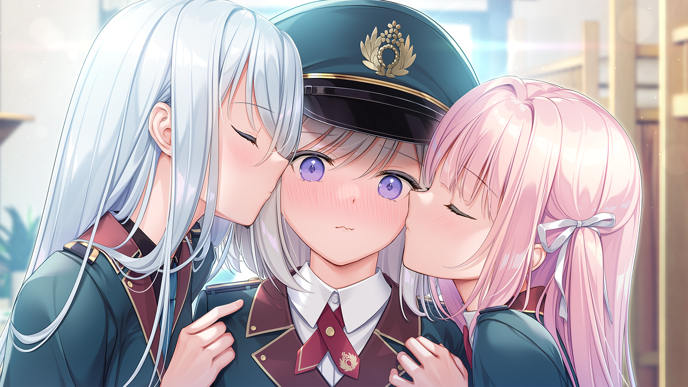

# 和解

在这个糟糕的世界，我遇到了你。

当烟花似的照明弹升空时，两人一定是无比幸福的吧。

对于这部《オトメ世界の歩き方》，我宁愿将故事中间的伪结局作为 True End，因为这才是故事的主基调，吗？

<!--more-->

当第一次进入游戏标题界面，BGM 响起，便仿佛进入到那《終末の世界》之中。正如全文第一句——「这个世界，真是一团糟。」——那是一种荒芜之感，带着一股心弦轻颤的悲伤之感。所以，我想让结局也带上这种意味。

当然，如此想法是自私的。实际情况是，整个故事充满了轻松愉快的氛围，并无过多的末世元素，所以，即便用多结局的方式改写，这也勉强算 Bad End 而非 True End。

另一方面，整个世界观设定更是毫无逻辑可言，请原谅我实在无法想象到底如何才能在没有奇幻元素的背景下造就如此离奇的发展。虽说现实比小说更魔幻，但现实可以不讲（你看到的）逻辑，小说却需要。很不幸的是，男主女装潜入这一根本剧情完全依赖于世界观，于是一切皆无法成立。

那又该如何呢？唯有和解。抛去脑子，一笑而过便可。

这是否意味着我们可以把这部作品当作废萌游玩呢？难。因为糅合要素过多，当今社会热点可以说是一个不落，而这也是缺乏逻辑的主要原因。只挖坑不填坑，似是而非，狗屁不通。

不过整个故事也并非毫无亮点。比如佐伯一家的故事，尤其是瑠璃子这位角色的个人遭遇还是很令人感到唏嘘。身为总统千金，身份尊贵，却也中二傲娇且平易近人，嘴上不饶人，实际却很关心身边的朋友和亲人。这样的一位少女却屡遭不幸，让人不禁感叹世界的残酷、个人的渺小、生命的脆弱。虽说是亮点，但仍旧残缺，请问，加一点母女间的描写或是回忆童年的剧情很难吗？

我没有想要刻意批评这部作品的恶意，这篇文章只不过是一名重视剧情的玩家在期待值拉满的情况下等待数月又遭遇跳票，总算迫不及待地玩上游戏，但在后续复盘时发现漏洞百出后的小小吐槽罢了。抛开这些所谓的缺点仅作为一部普通的爱情喜剧来欣赏，加上 mignon 老师的顶级作画以及小男娘设定（哇，这个角色真好看！欸？这是男主？！），整部作品还是蛮有意思的。

我觉得这张 CG 还是还可爱的，你说呢？

> 文中 CG 图片来自游戏解包，工具为 [KrkrzExtract](https://github.com/xmoezzz/KrkrzExtract)。
>
> 4K 图片：[otomeki.tar.zst](https://cdn.moecm.com/public/otomeki.tar.zst)，使用 [AutoCGAligner](https://github.com/CjangCjengh/AutoCGAligner) 合成。
